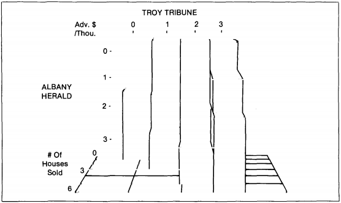
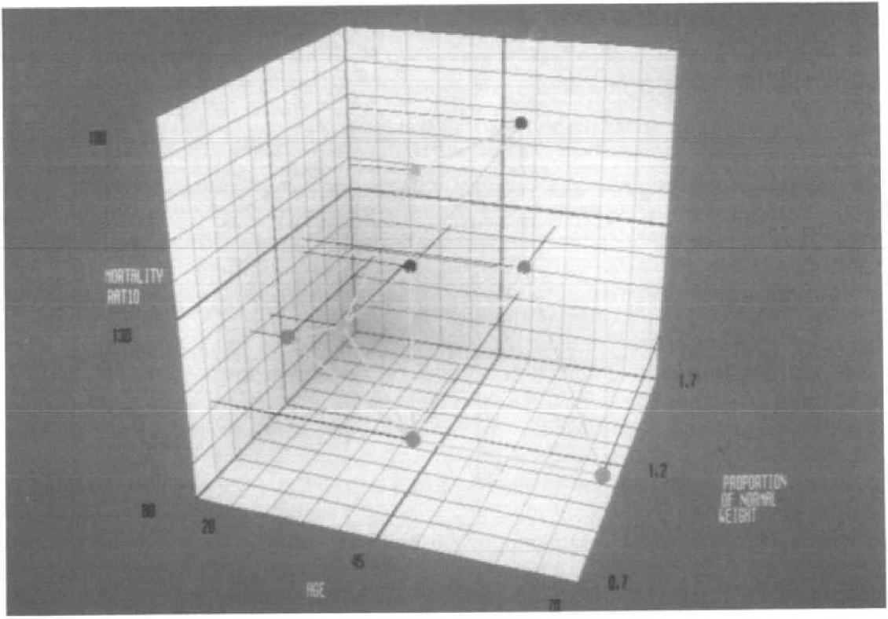
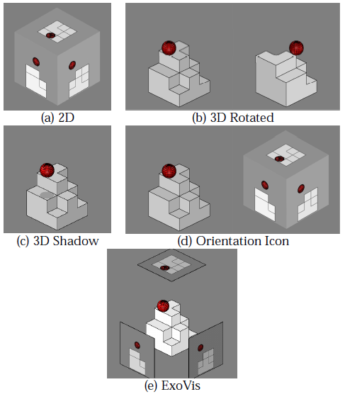
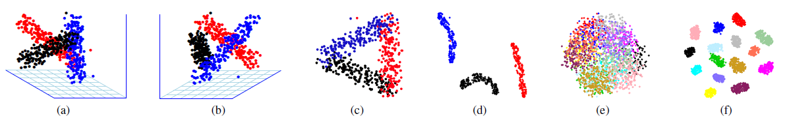
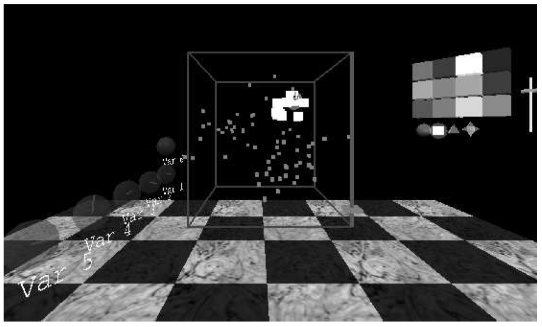

```{r setup_02, include=FALSE}
knitr::opts_chunk$set(
  fig.align = "center",
  echo = F, message = F, warning = F, error = F, cache = F, cache.lazy = F
)
```

<!-- Imagine you are writing for your fellow PhD students. Topics that are well-known to them do not have to be included here. But things that they may not know about should be included. -->

<!-- Resist the temptation to discuss everything you've read in the last few years. And you are not writing a textbook either. This chapter is meant to provide the background necessary to understand the material in subsequent chapters. Stick to that. -->

<!-- You will need to organize the literature review around themes, and within each theme provide a story explaining the development of ideas to date. In each theme, you should get to the point where your ideas will fit in. But leave your ideas to later chapters. This way it is clear what has been done beforehand, and what new contributions you are making to the research field. -->

# Literature review {#ch:lit_review}

## Dynamic projections of multivariate data (Touring) {#sec:tour}


### Overview

In univariate data sets histograms, or smoothed density curves are employed to visualize data. In bivariate data scatterplots and contour plots (2D density) can be employed. In three dimensions the two most common techniques are: 2D scatter plot with the 3rd variable as an aesthetic (such as, color, size, height, $etc.$) or rendering the data in a 3D volume using some perceptive cues giving information describing the seeming depth of the image \footnote{Graphs of data depicting 3 dimension are typically printed on paper, or rendered on a 2D monitor, they are intrinsically 2D images. They are sometimes referred to as 3D, or more frequently erroneously referred to as 3-d, more on this later.}. When there are 4 variables: 3 variables as spatial-dimensions and a 4th as aesthetic, or a scatterplot matrix consisting of 4 histograms, and 6 unique combinations of bivariate scatterplots. 

Let $p$ be the number of numeric variables; how do we visualize data for even modest values of $p$ (say 6 or 12)? It's far too common that visualizing in data-space is dropped altogether in favor of modeling parameter-space, model-space, or worse: long tables of statistics without visuals [@wickham_visualizing_2015]. Yet, we all know of the risks inherent in relying too heavily on parameters alone [@anscombe_graphs_1973; @matejka_same_2017]. So why do we move away from visualizing in data-space? Scalability, in a word, we are not familiar with methods that allow us to concisely depict and digest $p \geq 5$ or so dimensions. This is where dimensionality reduction comes in. Specifically, we will be focusing on a specific group called touring. In the interest of time I will not belabor the diversity of dimensionality reduction, (see [@grinstein_high-dimensional_2002; @carreira-perpinan_review_1997; heer_tour_2010] for a quick summary). Suffice it to say that touring has a couple of salient features: linear transformations such that we can interpolate back to the original variable space and does not discard dimensions, something that is common to other linear techniques. By employing the breadth of tours, we can preserve the visualization of data-space, and with it, the intrinsic understanding of structure and distribution of data that is more succinct or beyond the reach of statistic values alone.

Touring is a linear dimensionality reduction technique that orthogonally projects $p$-space down to $d(\leq p)$ dimensions. Many such projections are interpolated, each making rotations in $p$-space. These frames are then viewed in order as an animation of the lower dimensional embedding changing as the original variable space manipulated. Shadow puppets offer a useful analogy to aid in conceptualizing touring. Imagine a fixed light source facing a wall. When a hand or puppet is introduced the 3-dimensional object projects a 2D shadow onto the wall. This is a physical representation of a simple projection, that from $p=3$ down to $d=2$. If the object rotates then the shadow correspondingly changes. Observers watching only the shadow are functionally watching a 2D tour as the 3D object is manipulated. In some views more information is hidden than in others, and complex structures generally require more time to comprehend the nature of the geometry.


#### Terminology

Terminology varies across articles. In my work, I use the following:

* $n$, number of observations
* $p$, number of numeric variables, the dimensionality of data space,
* $d$, dimensionality of projection space
* $\textbf{X}_{[n,~p]}$, a data matrix in variable-space, $\textbf{X} \in \mathbb{R}^{p}$. Typically centered, scaled, and optionally sphered.
* $B_{[p,~d]}$, orthonormal basis vector, defining the orientation of projection from $p-$ to $d-$space
* $\textbf{Y}_{[n,~d]}$, projected data matrix in projection-space, $\textbf{Y} \in \mathbb{R}^{d}$

* For projections down to 1- and 2D, it’s common to display the contribution and direction on its own axis (1D) or relative to a unit circle (2D), this is sometime referred to as basis axes or a reference frame.
* Geometric objects are referred to in generalized dimensions; the use of plane isn't necessarily a 2D surface, but a hyper-plane in the arbitrary dimensions of the projection space.


### History

Touring was first introduced by Asimov in 1985 with his purposed Grand Tour[@asimov_grand_1985] at the Stanford Linear Accelerator, Stanford University. In which, Asimov suggested three types of grand tours: torus, at-random, and random-walk. The specifics of which will be discussed below in the Typology section. The original application of touring was on high energy physics on the PRIM-9 system.

Before choosing projection paths randomly, an exhaustive search of was suggested by @mcdonald_interactive_1982, also at the Stanford Linear Accelerator, and acknowledges Asimov and Buja.

In 1974 Friedman and Tukey purposed Projection Pursuit[@friedman_projection_1974] (sometimes referred to as PP) while working at Bell Labs. Projection Pursuit involves identifying "interesting" projection, remove a single component of the data, and then iterate in this newly embedded subspace. Within each subspace the projection seeks for a local extremum via hill climbing algorithms. This formed the basis for guided tours @hurley_analyzing_1990, 

<!-- * torus: where a $p$-dimensional torus, $T^p$ is created from a Cartesian product of $p$ unit circles with $T^p \in \mathbb{R}^p$. Unfortunately, uniformity of the parameters does not correlate to uniform points on the surface of the torus. If step distance between frames is fixed, disproportionate time is spent between subspaces. If step distance is change to account for uniform points on the torus then the continuity of the tour is lost.   -->
<!-- * at-random: where each 2-frame is chosen at random without replacement. This affords an assured uniform distribution of subspaces but is far too discontinuous for observation. It also leaves no parameters to control. -->
<!-- * random-walk: combines the continuity of the torus method and the uniformity of the at-random method while leaving room for a control parameter.  -->

The grand and little tour have no input from the user aside from the starting basis. Projection Pursuit allows for an index to be selected, but the bulk of touring development since has largely been around dynamic display, user interaction, geometric representation, and application. The extent to which will be expounded on in the following sections.
<!--see c2 paper, quoting: buja & asimov 1986, Hurley & Buja 1990, Wegman 1991, cook, buja, cabrera, & hurley 1995, buja, cook asimov & hurley 1997,cook & buja 1997. -->


### Path generation

A fundamental aspect of touring is the path of rotation. Of which there are four primary distinctions[@buja_computational_2005]: random choice, precomputed choice, data driven, and manual control.

* *grand tour*, a constrained random choice $p$-space. Paths are constrained for changes in direction small enough to maintain continuity and aid in user comprehension
    + torus-surface [@asimov_grand_1985]
    + at-random
    + random-walk
    + *local tour*, a sort of grand tour on a leash, such that it goes to a nearby random projection before returning to the original position and iterating
* *guided tour*, data driven tour that optimizing some objective function via projection pursuit[@hurley_analyzing_1990], analogous to gradient descent.
    + holes [@cook_projection_1993] - iterates projections that add more white space to the center of the projection.
    + cmass [@cook_projection_1993] - find the projection with the most density or mass in the center.
    + lda [@lee_projection_2005] - linear discriminant analysis, seeks a projection where 2 or more classes are most separated.
    + pda - principal component analysis finding where the data is most spread (1D only).
    + convex [@laa_using_2019] - the ratio of area of convex and alpha hulls.
    + skinny [@laa_using_2019] - the ratio of of the perimeter distance to the area of the alpha hull.
    + stringy [@laa_using_2019] - based on the minimum spanning tree (MST), the diameter of the MST over the length of the (MST).
    + dcor2D [@grimm_mbgraphic:_2017; @laa_using_2019] - distance correlation that finds linear and non-linear dependencies between variables.
    + splines2D [@grimm_mbgraphic:_2017; @laa_using_2019] - measure of non-linear dependence by fitting spline models.
    + other user-defined objective function can be implemented with the *tourr* package @wickham_tourr_2011.
* *planned tour*, Precomputed choice, in which the path has already been generated or defined.
    + *little tour* [@mcdonald_interactive_1982], where every permutation of variables is stepped through in order, analogous to a brute-force or exhaustive search.
    + a saved path of any other tour, typically an array of basis targets to interpolate between as produced by the R function `tourr::save_history()`.
* *manual tour* - Manual control, a constrained rotation on selected manipulation variable and magnitude[@cook_manual_1997]. Typically used to explore the local area after identifying an interesting feature from another tour.
* *dependence tour*, combination of $n$ independent 1D tours. A vector describes the axis each variable will be displayed on. *ie* $c(1, 1, 2, 2)$ is a 4 to 2D tour with the first 2 variables on the first axis, and the remaining on the second.
    + *correlation tour* [@buja_data_1987], a special case of the dependence tour, analogous to canonical correlation analysis

<!-- #### Interpolation -->

<!-- After target bases are identified, the frames in-between need to be filled in. There are several methods to do so: -->
<!-- * Geodesic -->
<!-- * Gram-Schimdt process -->
<!-- * Givens rotations -->
<!-- * Householder reflections -->

#### Tour path evaluation 

Consider $d=2$, then each projection is called a 2-frame (each spanning a 2-plane). Mathematically we call the set of all possible unoriented 2-frames in $p$-space a Grassmannian, $\textbf{Gr}(2,~p)$. @asimov_grand_1985 pointed out that the unique 2-frames of the grand tour approaches $\textbf{Gr}(2,~p)$ as time goes to infinity. We could then define the *density* of a tour as the fraction of the Grassmannian explored. Ideally a grand tour will be dense, but the time taken to become dense vastly increases as variable space increase dimensionality. We could then also talk about the *rapidity* of a tour as how quickly a tour encompasses the Grassmannian. Due to the random selection of a grand tour it will end up visiting homomorphisms of previous 2-frames, sub-optimal rapidity. 

The little tour introduced in @mcdonald_interactive_1982, on the other hand is necessarily both dense and rapid, performing essentially an exhaustive search on the Grassmannian. However, this path uninteresting and with long periods of similar projections strung together. There was a need to find interesting projections quicker.

Guided tours (@hurley_analyzing_1990) optimize an objective function generating path will be relatively small subset of the Grassmanian, density and rapidity become poor measures, while interesting projections are quickly identified. Recently, @laa_using_2019, compares projection pursuit indices with the metrics: smoothness, squintability, flexibility, rotation invariance and speed. See the original work to see how the indices perform.


### Geometric display dimensionality

Up to this point we have been talking about 2D scatterplots, which offer the first and a simple case for viewing lower-dimensional embeddings of $p$-space. However, other geometrics (or geoms) offer perfectly valid orthonormal projections as well.

* 1D geoms
    + 1D densities: such as histogram, average shifted histograms[@scott_averaged_1985], and kernel density[@scott_incorporating_1995].
    + image: [@wegman_pixel_2001]
    + time series: where multivariate values are independently lagged to view peak and trough alignment. Currently no package implementation, but use case is discussed in [@cook_manual_1997]. 
* 2D geoms
    + 2D density (available on Github at https://github.com/nspyrison/tourr)
    + $x-y$ scatterplot
* 3D geoms - these geoms do not perform project to 3 dimensions, but rather give depth perception cues into the add dimension of the manipulation space of 2D projection.
    + Anaglyphs, sometimes called stereo, where (typically) red images are positioned for the left channel and cyan for the right, when viewed with corresponding filter glasses give the depth perception of the image.
    + Depth, which use some subset of depth cues, most commonly size and/or color of data points.
* $d$-dimensional geoms
    + Andrews curves [@andrews_plots_1972], smoothed variant of parallel coordinate plots, discussed below. 
    + Chernoff faces [@chernoff_use_1973], variables linked to size of facial features for rapid cursory like-ness comparison of observations.
    + Parallel coordinate plots [@ocagne_coordonnees_1885], where any number of variables are plotted in parallel with observations linked to their corresponding variable value by polylines.
    + Scatterplot matrix [@becker_brushing_1987], showing a triangle matrix of bivariate scatterplots with 1D density on the diagonal.
    + Radial glyphs, radial variants of parallel coordinates including radar, spider, and star glyphs [@siegel_surgical_1972]. 


### Tour software implementations

Below is a non-exhaustive list of software implementing touring in some degree, ordered by descending year:
<!-- See hadley's thesis and, C2 paper for lists. -->

* spinifex [github.com/nspyrison/spinifex](https://github.com/nspyrison/spinifex) -- for Linux, Unix, and Windows.
* tourr [@wickham_tourr_2011] -- for Linux, Unix, and Windows. R package.
* CyrstalVision [@wegman_visual_2003] -- for Windows.
* GGobi [@swayne_ggobi:_2003] -- for Linux and Windows.
* DAVIS [@huh_davis:_2002] -- Java based, with GUI.
* ORCA [@sutherland_orca:_2000] -- Extensible toolkit build off the object-oriented Java.
* VRGobi [@nelson_xgobi_1998] -- for use with the C2, tours in stereoscopic 3D displays.
* ExplorN [@carr_explorn:_1996] -- for SGI Unix.
* XGobi [@swayne_xgobi:_1991] -- for Linux, Unix, and Windows (via emulation).
* XLispStat [@tierney_lisp-stat:_1990] -- for Unix, and Windows.
* Explor4 [@carr_explor4:_1988] -- Four-Dimensional Data Using Stereo-Ray Glyphs
* Prim-9 [@asimov_grand_1985;@fisherkeller_prim-9:_1974] -- on an internal operating system.

Support and maintenance of such implementations give them a particularly short life span, while conceptual abstraction and technically heavier implementations have hampered user growth. There have been notable efforts to diminish the barriers to entry and make touring more approachable as a data exploration tool [@huh_davis:_2002; @swayne_ggobi:_2003; @wegman_visual_2003; @wickham_tourr_2011; huang_tourrgui:_2012].


## Multivariate data visualization in 3D {#sec:3d}

As this research pertains to numeric multivariate data, we'll stick to this scope in the liturature review. For wider overview of 3d data vis see chapter 2 of @marriott_immersive_2018.


### Terminology

* 2D - representation of data in strictly 2 dimensions, without any indication to other information.
* 2.5D - any of the many degrees between 2- and 3D. Including aesthetic mapping (colors/size) to data points and use of some incomplete combination of depth cues. *Due to the ambiguity and breadth of use of 2.5D, we err on the side of 3D instead*, while any 2.5D graphics and inherently not 3D when viewed on standard monocular 2D monitors or print.
* 3D - stereoscopically true display of information with all depth cues in tack.
* Depth persception cues - an indication that tips off depth to an observer, including:
    * linear perspective - the property of parallel lines converging on a vanishing point.
    * aerial perspective - objects that are far away have lower contrast and color color saturation due to light scattering in the atmosphere.
    * occulation (or interposition) - where closer objects partially block the view of further objects.
    * motion perspective/parallax - closer objects, move accross the field of view faster than further objects
    * accommodation - the change of focal length due to change in the shape of the eye. Effective for distances of less than 2 meters.
    * binocular stereopsis/disparity - the use of 2 images of slightly varied angles from the horizontal distance of the eyes. The disparity for distant objects is small, but it significant for nearby objects.
    * binocular convergence - The occular-motor cue due to stereopsis focusing on the same objects. Convergence is effective for distances up to 10 meters.
* Virtual reality (VR) - computer generated display of virtual spaces in place of physical vision
* Augmented reality (AR) - computer generated display of information over laid on a physical space
* Mixed reality (MR) - any degree of virtual or augmented reality
* Scatterplot matrices (SPLOM) - matrix display of pair-wise 2D scatterplots


### A rocky start

Scientific visualization has readily adopted mixed realities as a large amount of the science exist in 3 spatial dimensions, lending itself well to virtual immersion. Data visualization, on the other hand, has been slow to utilize graphics above 2.5D, (and haptic interaction) primarily due to the mixed results of over-hyped of 3D visuals from the 1980's and 90's [@munzner_visualization_2014]. However, since then there have been several promising studies suggesting that it's time for data visualization to revisit and adopt 3D visuals for specific combinations of visuals and depth cues.


### 3D rotated projections vs 3 2D orthogonal projections 

3D shapes can be represented by 3 orthogonal 2D views, or rather 3 pairwise projections. When 3D representations are used with binocular cues, they are found to have more accurate perception than 2D counterparts [@lee_effects_1986, depicted in fig \@ref(fig:lee86fig)].

(ref:lee86fig-cap) Screen capture of "Figure 7. 3-D Block Model" from @lee_effects_1986. 

```{r lee86fig, echo=F, out.width='70%', fig.cap = "(ref:lee86fig-cap)"}

```


Between 3D and split view 2D of 3-dimensional economics data @wickens_implications_1994, depicted in fig \@ref(fig:wickens94fig), asked participants integrative questions, finding that participants were faster to answer when questions involved three dimensions, while performance was similar when questions involved fewer dimensions.

(ref:wickens94fig-cap) Screen capture of "Figure 5. Example of a mesh display" from @wickens_implications_1994.

```{r wickens94fig, echo=F, out.width='70%', fig.cap = "(ref:wickens94fig-cap)"}

```


Using 3D rotated projection gives accurate perception of a ball relative to complex box shapes, while combinations of 2D and 3D give the most precise orientation and positioning information [@tory_visualization_2006, depicted in fig \@ref(fig:tory06fig)].

(ref:tory06fig-cap) Screen capture from @tory_visualization_2006: "Fig. 1 (a) 2D, (b) 3D Rotated, (c) 3D Shadow, (d) Orientation Icon, and
(e) ExoVis displays used in Experiment 1 (position estimation). Participants
estimated the height of the ball relative to the block shape. In this
example, the ball is at height 1.5 diameters above the block shape."

```{r tory06fig, echo=F, out.width='50%', fig.cap = "(ref:tory06fig-cap)"}

```


@sedlmair_empirical_2013, depicted in fig \@ref(fig:sedlmair13fig), tasked users with cluster separation across 2D scatterplot, 2D scatterplot matrices (SPLOMs) and interactive 3D scatterplots as viewed in monocular 3D from a standard monitor. They conclude that interactive 3D scatterplots perform worse for class separation. This result is surprisingly as the extra dimension theoretically allows for clustering structure to be seen and explored more clearly.

(ref:sedlmair13fig-cap) Screen capture of "Figure 5. Example of a mesh display" from @sedlmair_empirical_2013: "Fig. 5. (a)-(d): Screenshots of the entangled dataset `entangled1-3d-3cl-separate` designed to show the most possible benefits for i3D. (a),(b) two viewpoints of the same i3D PCA scatterplot. An accompanying video shows the full 3D rotation. (c) 2D PCA projection. (d) t-SNE untangles this class structure in 2D. (e)-(f): 2D scatterplots of the reduced `entangled2-15d-adjacent` dataset which we designed to have a ground truth entangled class structure in 15D. (e) Glimmer MDS cannot untangle the classes, neither can PCA and robPCA (see supplemental material). (f) t-SNE nicely untangles and separates the ground truth classes in 2D."

```{r sedlmair13fig, echo=F, out.width='100%', fig.cap = "(ref:sedlmair13fig-cap)"}

```


### Comparing 3D and 2D embeddings of multivariate data

@nelson_xgobi_1998, depicted in fig \@ref(fig:nelson98fig), had $n=15$ participants perform brushing and touring tasks (identification of clusters, structure, and data dimensionality) in 3D with head-tracked binocular VR. 3D proved to have substantial advantage for cluster identification and some advantage in in identifying shape. Brushing did take longer in VR, perhaps due to the lower familiarity of manipulating 3D spaces. 

(ref:nelson98fig-cap) Screen capture from @nelson_xgobi_1998: "Figure 4: This is a picture of a 3-D room, running VRGobi. Data is plotted in the center, with painting tools to the right and variable spheres to the left. In the viewing box the data can be seen to contain three clusters, and one is being brushed."

```{r nelson98fig, echo=F, out.width='70%', fig.cap = "(ref:nelson98fig-cap)"}

```


Another study, @gracia_new_2016, depicted in fig \@ref(fig:gracia16fig), performed dimensionality reduction down to 2- and 3D scatterplots, both displayed in monocular 3D on a standard monitor. Users were found to more accurately compare distances between points and identify outliers on 3D scatterplots. However, both tasks were performed slower with use of the 3D scatterplots and statistical significance was not reported.

(ref:gracia16fig-cap) Screen capture from @gracia_new_2016: "Figure 5. Distance perception test. Left-hand image: 2D version. Here, the yellow line could be perceived as roughly twice the length of the magenta line, thus the value to be introduced should be approximately 2.0. Right-hand image: 3D version. Here, the inclusion of an extra dimension could provide new information about the relation, in terms of distances, between both lines."

```{r gracia16fig, echo=F, out.width='70%', fig.cap = "(ref:gracia16fig-cap)"}
knitr::include_graphics("./figures/gracia16fig")
```


@wagner_filho_immersive_2018, depicted in fig \@ref(fig:wagner18fig), performed an $n=30$ empirical study of PCA embedded projections, and perception error across 4 tasks and 3 display types: 2D, 3D, and immersive. Overall task error was less in 3D and immersive relative to 2D. According to user Likert-scale 2D is slightly easier to navigate and slightly more comfortable. Conversely, 3D and immersive are slightly easier to interact and moderately easier to find information.

(ref:wagner18fig-cap) Screen capture from @wagner_filho_immersive_2018, original captions contained in capture.

```{r wagner18fig, echo=F, out.width='50%', fig.cap = "(ref:wagner18fig-cap)"}
knitr::include_graphics("./figures/wagner18fig")
```
