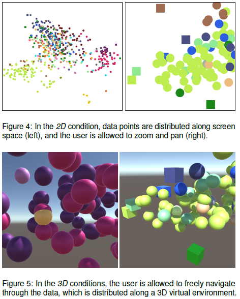
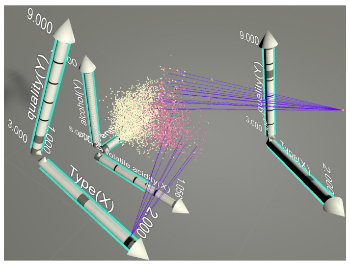

```{r setup_02, include=FALSE}
knitr::opts_chunk$set(
  fig.align = "center",
  echo = F, message = F, warning = F, error = F, cache = F, cache.lazy = F
)
library(spinifex)
library(gganimate) 
library(ggplot2)
library(magrittr)
library(knitr)
library(kableExtra)
```


# Literature review {#ch:lit_review}

The following chapter discusses the current research in two primary areas: dynamic linear projections (collectively known as tours) and multivariate data visualization in stereoscopic 3D. After each section, research gaps are highlighted.


## Dynamic linear projections of multivariate data (tours) {#sec:tour}


### Overview

The introduction established that visualizing data-space is an important aspect of exploratory data analysis and data analysis in general. Yet, there is an inherent difficulty as the dimensionality of data increases. In univariate data sets histograms or smoothed density curves are employed to visualize data. In bivariate data, $XY$ scatterplots and contour plots (2D density) can be employed. In three dimensions, the two most common techniques are 3D scatterplot\footnote{Graphs depicting three dimensions are typically viewed on a 2D display, in print or with a standard monitor. These are 2D images of monocular 3D spaces, sometimes referred to as 2.5D data visualization, more on this in section \ref{sec:3d-terminology}.} or 2D scatterplot with the 3rd variable as an aesthetic (such as color, size, or height). These aesthetic cues convey some information but are not a sufficient replacement for axes for use with continuous variables.

As dimensionality of the data, $p$, increases the visualization of data-space quickly becomes complex. It is common that visualizing data-space is dropped in favor of graphing model-space (for example residuals), parameter-space (in fewer dimensions), or worse yet: long tables of statistics without visuals [@wickham_visualizing_2015]. To preserve the visualization of data-space, a solution that scales with the dimensionality of data is needed; this is where dimensionality reduction comes in. This work will focus on a group of dynamic linear projection techniques collectively known as *tours*. The scope of the project lies within the dynamic linear projections; a broader review of dimensionality reduction techniques is discussed in the review paper by  @grinstein_high-dimensional_2002. Tours are used for a couple of salient features: the use of linear projections maintains transparency back to the original variable space (which non-linear projections lose) and the use of many projections shows more variation than a single linear projection. Employing the breadth of tours extends the dimensionality of visualizations, and with it, the intrinsic understanding of the structure and distribution of data that is more succinct or beyond the reach of summary statistics alone.

Let $p$ be the dimensionality of the data, and $d$ be the dimension of the projection space. Tours perform linear dimensionality reduction, orthogonally projecting $p$-space down to $d(\leq p)$ dimensions. Many such projections are interpolated, each making small rotations in $p$-space. These frames are then viewed in order as an animation of the lower dimensional embedding changing as the original variable space is manipulated. Shadow puppets offer a useful analogy to aid in conceptualizing tours. Imagine a fixed light source facing a wall. When an object is introduced it projects a 2D shadow onto the wall. This is a physical representation of a simple projection, that from $p=3$ down to $d=2$. If the object rotates then the shadow correspondingly changes. Observers watching only the shadow are functionally watching a 2D tour as the 3D object is manipulated. Some orientations explain more information about the shape of the object than others while watching an animation of the shadow changing gives a more robust understanding than looking at any one frame. More complex structures generally require more time to comprehend the nature of the geometry. These features hold for tours as well.

*An extended tour notation is listed in the appendix section \ref{sec:tour_notation}.*

<!-- ### Notation {#sec:terminology_tours} -->
<!-- Notation moved to appendix A in 90-appA.Rmd. -->

### History

The first tour was introduced was the *grand tour* in @asimov_grand_1985 at the Stanford Linear Accelerator, Stanford University. Asimov suggested three types of grand tours: torus, at-random, and random-walk. The original application of tours was performed on high energy physics on the PRIM-9 system.

Before choosing projection paths randomly, an exhaustive search of $p-$space was suggested by @mcdonald_interactive_1982, also at the Stanford Linear Accelerator. This was later coined *little tour*.
<!-- Buja and Asimov were in the acknowledgments. -->

@friedman_projection_1974 and later @huber_projection_1985 recommended projection pursuit (also referred to as PP). Projection pursuit optimizes an objective function before it removes a single component/variable and then iterates in this newly embedded subspace. Within each subspace, the projection seeks for a local extremum via a hill climbing algorithm on an objective function. This formed the basis for *guided tours* suggested by @hurley_analyzing_1990.

The grand and little tours have no input from the user aside from the starting basis. Guided tours allow for an index to be selected. The bulk of tour development since has largely been around the dynamic display, user interaction, geometric representation, and application.
<!--Note c2 paper, pointing to: Buja & Asimov 1986, Hurley & Buja 1990, Wegman 1991, Cook, Buja, Cabrera, & Hurley 1995, Buja, Cook Asimov & Hurley 1997,Cook & Buja 1997. -->


### Path generation {#sec:path_generation}

A fundamental aspect of tours is the path of rotation. There are four primary distinctions of tour path generation [@buja_computational_2005]: random choice, data-driven, precomputed choice, and manual control.

* Random choice, *grand tour*, constrained random walks $p$-space. Paths are constrained for changes in direction small enough to maintain continuity and aid in user comprehension
    + torus-surface [@asimov_grand_1985]
    + at-random [@asimov_grand_1985]
    + random-walk [@asimov_grand_1985]
    + *local tour* [@wickham_tourr_2011], a sort of grand tour on a leash, such that it goes to a nearby random projection before returning to the original position and iterating to a new nearby projection.
* Data-driven, *guided tour*, optimizing some objective function/index within the projection-space, called projection pursuit (PP) [@hurley_analyzing_1990], including the following indexes:
    + holes [@cook_projection_1993] - moves points away from the center.
    + cmass [@cook_projection_1993] - moves points toward the center. 
    + lda [@lee_projection_2005] - linear discriminant analysis, seeks a projection where 2 or more classes are most separated.
    + pda [@lee_projection_2010] - penalized discriminant analysis for use in highly correlated variables when classification is needed.
    + convex [@laa_using_2019] - the ratio of the area of convex and alpha hulls.
    + skinny [@laa_using_2019] - the ratio of the perimeter distance to the area of the alpha hull.
    + stringy [@laa_using_2019] - based on the minimum spanning tree (MST), the diameter of the MST over the length of the MST.
    + dcor2D [@grimm_mbgraphic:_2017; @laa_using_2019] - distance correlation that finds linear and non-linear dependencies between variables.
    + splines2D [@grimm_mbgraphic:_2017; @laa_using_2019] - measure of non-linear dependence by fitting spline models.
    + other user-defined objective indices can be applied to the framework provided in the *tourr* package @wickham_tourr_2011.
    + Another data-drive tour is the *dependence tour*, a combination of $n$ independent 1D tours. A vector describes the axis each variable will be displayed on. for example $c(1, 1, 2, 2)$ is a 4- to 2D tour with the first 2 variables on the first axis, and the remaining on the second.
        - *correlation tour* [@buja_data_1987], a special case of the dependence tour, analogous to canonical correlation analysis.
* Precomputed choice, *planned tour*, in which the path has already been generated or defined.
    + *little tour* [@mcdonald_interactive_1982], where every permutation of variables is stepped through in order, analogous to brute-force or exhaustive search.
    + a saved path of any other tour, typically an array of basis targets to interpolate between.
* Manual control, *manual tour*, a constrained rotation on selected manipulation variable and magnitude [@cook_manual_1997]. Typically used to explore the local area after identifying an interesting feature, perhaps via guided tour.


<!-- ### Interpolation -->

<!-- NOTE: Search 'Interpolator' in Wickham’s tourr paper--> 
<!-- After target bases are identified, the frames in-between need to be filled in. There are several methods to do so: -->

<!-- * Geodesic - via Gram-Schmidt process -->
<!-- * Givens rotations -->
<!-- * Householder reflections -->

### Path evaluation 

Consider projection down to 2D, then each projection is called a 2-frame (each spanning a 2-plane). Mathematically, a Grassmannian is the set of all possible unoriented 2-frames in $p$-space, $\textbf{Gr}(2,~p)$. @asimov_grand_1985 pointed out that the unique 2-frames of the grand tour approaches $\textbf{Gr}(2,~p)$ as time goes to infinity. The *density* of a tour is defined as the fraction of the Grassmannian explored. Ideally, an exploring tour will be dense, but the time taken to become dense vastly increases as variable space increases dimensionality. *Rapidity* is then defined as how quickly a tour encompasses the Grassmannian. Due to the random selection of a grand tour, it will end up visiting homomorphisms of previous 2-frames before all unique values are visited, leading sub-optimal rapidity. 

The little tour introduced in @mcdonald_interactive_1982, on the other hand, is necessarily both dense and rapid, performing essentially an exhaustive search on the Grassmannian. However, this path uninteresting and with long periods of similar projections strung together. The Grassmannian is necessarily large and increases exponentially at the rate of $p$. Viewing of the whole Grassmannian is time-consuming, and interesting projections are sparse, there was a clear space for computers to narrow the search space.

Guided tours [@hurley_analyzing_1990] optimize an objective function generating path will be a relatively small subset of the Grassmannian. As they are not used for exploration, density and rapidity are poor measures. On the other hand, they excel at finding interesting projections quickly. Recently, @laa_using_2019, compared projection pursuit indices with the metrics: *smoothness, squintability, flexibility, rotation invariance* and *speed*. 


### Geometric display by dimensionality {#sec:geom_display}

Up to this point, 2D scatterplots have been the primary display discussed, they offer a logical display for viewing embeddings of high-dimensional point clouds. However, other geometrics offer perfectly valid projections as well.

* 1D geometrics (geoms)
    + 1D densities: such as histogram, average shifted histograms [@scott_averaged_1985], and kernel density [@scott_incorporating_1995].
    + image (pixel): [@wegman_pixel_2001].
    + time series: where multivariate values are independently lagged to view peak and trough alignment. Use case is discussed in [@cook_manual_1997]. 
* 2D geoms
    + 2D density (available on GitHub at https://github.com/nspyrison/tourr)
    + $XY$ scatterplot
* 3D geoms
    + Anaglyphs, sometimes called stereo, where red images are positioned for the left channel and cyan for the right when viewed with corresponding filter glasses give a perception of depth to the image.
    + Depth, which gives depth cues via aesthetic mappings, most common size and/or color of data points.
* $d$-dimensional geoms
    + Andrews curves [@andrews_plots_1972], smoothed variant of parallel coordinate plots, discussed below. 
    + Chernoff faces [@chernoff_use_1973], variables linked to the size of facial features. The idea is to apply the human facial-perception for rapid, cursory, like-ness comparisons between observations.
    + Parallel coordinate plots [@ocagne_coordonnees_1885; wegman_hyperdimensional_1990], where any number of variables are plotted in parallel with observations linked to their corresponding variable value by polylines.
    + Scatterplot matrix (SPLOM) [@chambers_graphical_1983], showing a triangle matrix of bivariate scatterplots with 1D density on the diagonal.
    + Radial glyphs, radial variants of parallel coordinates including radar, spider [@duffin_spiders:_1994], and star glyphs [@siegel_surgical_1972]. 

### Tour software

Tours have yet to be widely adopted, due in part, to the fact that print and static .pdf output does not accommodate dynamic viewing. Conceptual abstraction and technically density have also hampered user growth. Due to low levels of adoption and the rapid advancement of technology support and maintenance of such implementations give them a particularly short life span. Despite the small user base, there have been a fair number of tour implementations, including:
<!-- See Wickham’s thesis and C2 paper for partial lists. -->

* spinifex [github.com/nspyrison/spinifex](https://github.com/nspyrison/spinifex) -- R package, all platforms.
* tourr [@wickham_tourr_2011] -- R package, all platforms.
* CyrstalVision [@wegman_visual_2003] -- for Windows.
* GGobi [@swayne_ggobi:_2003] -- for Linux and Windows.
* DAVIS [@huh_davis:_2002] -- Java based, with GUI.
* ORCA [@sutherland_orca:_2000] -- Extensible toolkit build in Java.
* VRGobi [@nelson_xgobi_1998] -- for use with the C2, tours in stereoscopic 3D displays.
* ExplorN [@carr_explorn:_1996] -- for SGI Unix.
* ExploRe [@hardle_xplore:_1995]
* XGobi [@swayne_xgobi:_1991] -- for Linux, Unix, and Windows (via emulation).
* XLispStat [@tierney_lisp-stat:_1990] -- for Unix and Windows.
* Explor4 [@carr_explor4:_1988] -- Four-dimensional data using stereo-ray glyphs.
* Prim-9 [@asimov_grand_1985;@fisherkeller_prim-9:_1974] -- on an internal operating system.


### Research gaps

Dynamic projections offering UCS have not incorporated recent animation frameworks (**RO #1**). This leaves the class of dynamic linear projections without the most precise, fine-scale control of rotating $p$-space. This should be implemented with an eye on extensibility and maintainability.

A comparative study outlining the benefits of UCS vs alternatives is also absent from the literature (**RO #2**). The benefits of dynamic linear projections hold in theory, but a direct comparison with popular alternatives should be made. Barriers to adoption and sharing should also be kept in mind as the dynamic display is not easy to display on print and in .pdf documents.


## Multivariate data visualization in 3D {#sec:3d}

The scope of this research pertains to numeric multivariate data, a wider overview of 3D data visualization is discussed in chapter 2 of @marriott_immersive_2018. Terminology for 3D visuals is in the glossary section \ref{sec:3d-terminology}.


### A rocky start

Scientific visualization has readily adopted mixed realities as a large amount of the science exists in three spatial dimensions, lending itself well to virtual immersion [@marriott_immersive_2018]. Data visualization, on the other hand, has been slow to utilize graphics above 2.5D, (and haptic interaction) primarily due to the mixed results of over-hyped of 3D visuals from the 1980s and '90s [@munzner_visualization_2014]. Since then, however, there have been several promising studies suggesting that it is time for data visualization to revisit and adopt the use of 3D visuals for specific combinations of displays and depth cues.


### 3D rotated projections vs 3 2D orthogonal projections 

Three orthogonal 2D views can represent the three face-on views of 3D shapes. When 3D representations are used with binocular cues, they are found to have more accurate perception than 2D counterparts [@lee_effects_1986].

Between 3D and split view 2D of three-dimensional economics, data @wickens_implications_1994 asked participants questions integrating several variables, finding that 3D visuals resulted in faster answers when questions involved three dimensions, while the speed was similar when questions involved fewer dimensions.

Using 3D rotated projections gives more precise (relative to 2D) estimates of the height a ball is suspended above complex box shapes, while combinations of 2D and 3D give the most precise orientation and positioning information [@tory_visualization_2006, depicted in figure \@ref(fig:tory06fig)].


(ref:tory06fig-cap) Screen capture from @tory_visualization_2006: "fig. 1 (a) 2D, (b) 3D Rotated, (c) 3D Shadow, (d) Orientation Icon, and (e) ExoVis displays used in Experiment 1 (position estimation). Participants estimated the height of the ball relative to the block shape. In this example, the ball is at height 1.5 diameters above the block shape."

```{r tory06fig, echo=F, out.width='50%', fig.cap = "(ref:tory06fig-cap)"}
knitr::include_graphics("./figures/tory06fig.PNG")
```


@sedlmair_empirical_2013, depicted in figure \@ref(fig:sedlmair13fig), asked users about cluster separation across 2D scatterplots, 2D scatterplot matrices (SPLOMs) and interactive 3D scatterplots, PCA (linear projection), and t-SNE (non-linear projection) as viewed in monocular 3D from a standard monitor. They conclude that interactive 3D scatterplots perform worse for class separation. This result is surprising as the extra dimension theoretically allows for the clustering structure to be seen and explored more clearly.


(ref:sedlmair13fig-cap) Screen capture of "figure 5. example of a mesh display" from @sedlmair_empirical_2013: "fig. 5. (a)-(d): Screenshots of the entangled dataset `entangled1-3d-3cl-separate` designed to show the most possible benefits for i3D. (a),(b) two viewpoints of the same i3D PCA scatterplot. An accompanying video shows the full 3D rotation. (c) 2D PCA projection. (d) t-SNE untangles this class structure in 2D. (e)-(f): 2D scatterplots of the reduced `entangled2-15d-adjacent` dataset which we designed to have a ground truth entangled class structure in 15D. (e) Glimmer MDS cannot untangle the classes, neither can PCA and robPCA (see supplemental material). (f) t-SNE nicely untangles and separates the ground truth classes in 2D."

```{r sedlmair13fig, echo=F, out.width='100%', fig.cap = "(ref:sedlmair13fig-cap)"}
knitr::include_graphics("./figures/sedlmair13fig.PNG")
```


### Comparing 3D and 2D embeddings of multivariate data

@nelson_xgobi_1998, depicted in figure \@ref(fig:nelson98fig), had $n=15$ participants perform brushing and identification tasks (of clusters, structure, and data dimensionality) in 3D with head-tracked binocular VR. 3D proved to have a substantial advantage for cluster identification and some advantage in identifying the shape. Brushing did take longer in VR, perhaps due to the lower familiarity of manipulating 3D spaces. 


(ref:nelson98fig-cap) Screen capture from @nelson_xgobi_1998: "figure 4: This is a picture of a 3-D room, running VRGobi. Data is plotted in the center, with painting tools to the right and variable spheres to the left. In the viewing box, the data can be seen to contain three clusters, and one is being brushed."

```{r nelson98fig, echo=F, out.width='70%', fig.cap = "(ref:nelson98fig-cap)"}
knitr::include_graphics("./figures/nelson98fig.PNG")
```


Another study, @gracia_new_2016 performed dimensionality reduction down to 2- and 3D scatterplots, both displayed in monocular 3D on a standard monitor. Users were found to more accurately compare distances between points and identify outliers on 3D scatterplots. However, both tasks were performed slower with the use of the 3D scatterplots and statistical significance was not reported.


@wagner_filho_immersive_2018, depicted in figure \@ref(fig:wagner18fig), performed an $n=30$ empirical study on PCA embedded projections, measuring perception error across 4 tasks and 3 display types: 2D, static 3D, and immersive 3D. Overall task error was less in static and immersive 3D relative to 2D. According to the user Likert-scale survey, 2D is slightly easier to navigate and slightly more comfortable, while, static and immersive 3D displays are slightly easier to interact with and moderately easier to find information on.

(ref:wagner18fig-cap) Screen capture from @wagner_filho_immersive_2018, original captions contained in the capture.

```{r wagner18fig, echo=F, out.width='50%', fig.cap = "(ref:wagner18fig-cap)"}

```


### Immersive analytics platform in VR

Immersive analytics is an emerging field, where data visualization and analysis is facilitated in an intuitive, immersive virtual reality environment [@chandler_immersive_2015; @cordeil_immersive_2017]. An example of which is shown in @cordeil_imaxes:_2017 introduces a collaborative space for immersive data analysis. Where axes are displayed and intuitively interacted with while responding to proximity to other variable axes and popping into place changing the resulting geometric display. For example, three variables can be placed as the $x,~y,~z-$ axes for a 3D scatterplot or stood up right next to each other for a parallel coordinate plot. The subsequent work in @cordeil_immersive_2019 builds from the previous reference and refines it for the next iteration in interactive, scalable data visualization in virtual spaces.


(ref:cordeil2017fig-cap) Screen capture of figure 15 from @cordeil_imaxes:_2017.

```{r cordeil2017fig, echo=F, out.width='50%', fig.cap = "(ref:cordeil2017fig-cap)"}

```


### Research gaps

When comparing between 2- and 3D orthogonal views, in general, studies show that perception accuracy is better in 3D, though manipulation speed is generally slower. The speed discrepancy is confounded by the difference in users familiar with manipulating 2D vs 3D spaces [@lee_effects_1986; @wickens_implications_1994; @tory_visualization_2006; counterexample @sedlmair_empirical_2013]. 

Similar results have been shown in static, 3D projected spaces [@gracia_new_2016; @wagner_filho_immersive_2018] and in dynamic 2D embedded spaces depicted in immersive 3D [@nelson_xgobi_1998]. Modern VR hardware brings about a steady improvements to quality, resolution while driving down cost, making VR more easily accessible than ever. It's timely to review dynamic 3D projections and do so in immersive spaces to quantify the corresponding benefits (**RO #3 & 4**).
