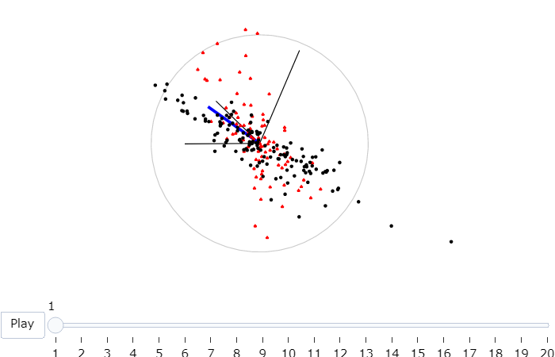
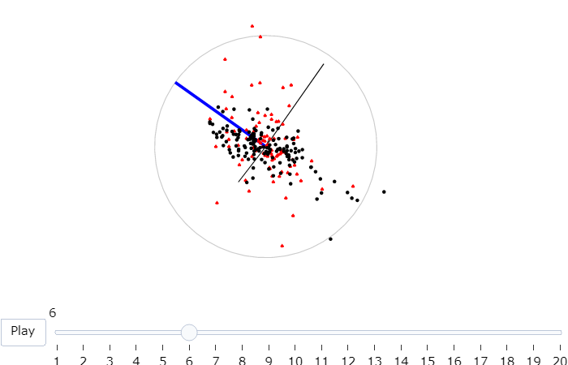
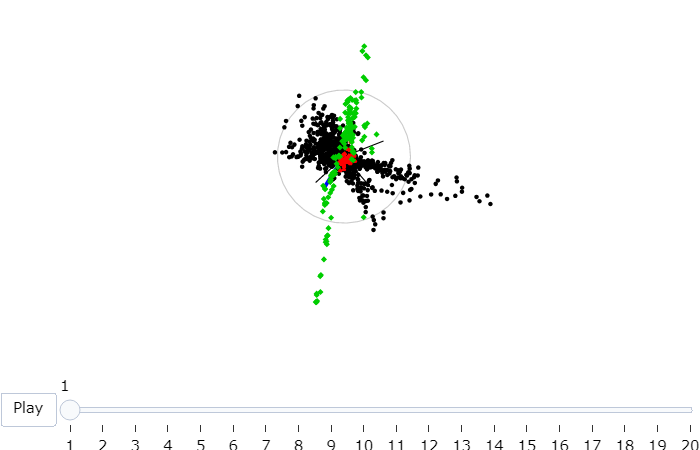
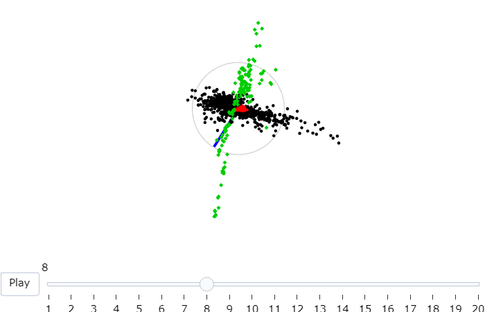
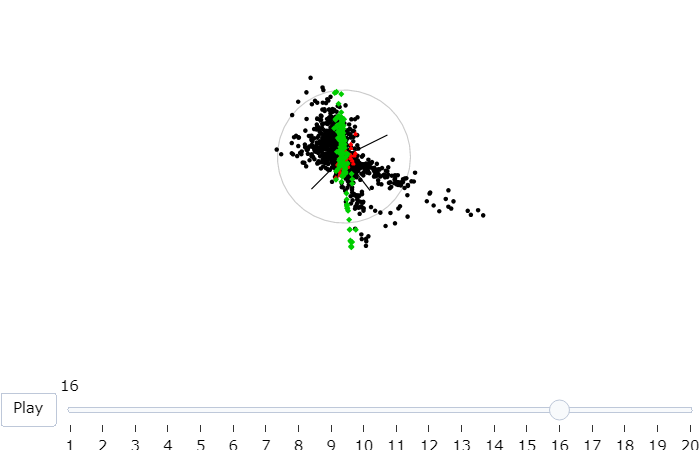

```{r setup_03, include=FALSE}
knitr::opts_chunk$set(
  fig.width = 6, 
  fig.asp = 1/1.61, 
  fig.align = "center",
  echo = TRUE, 
  message = FALSE,
  warning = FALSE,
  error = FALSE,
  collapse = TRUE,
  comment = "",
  cache = FALSE
)
```

# *spinifex*: An R package that provides manual rotations in high-dimensions {#ch:spinifex}

## Abstract

The tour algorithm, and its various versions provide a systematic approach to viewing low-dimensional projections of high-dimensional data. It is particularly useful for understanding multivariate data, and useful in association with techniques for dimension reduction, supervised and unsupervised classification. The *R* package *tourr* provides manhy methods for conducting tours on multivariate data. This paper discusses an extension package which adds support for the manual tour, called  *spinifex*. It is particularly usefully for exploring the sensitivity of structure discovered in a projection by a guided tour, to the contribution of a variable. *Spinifex* utlizes the animation packages *plotly* and *gganimation* to allow users to rotate a variable into and our of a chosen projection. 

Keywords: grand tour, projection pursuit, manual tour, high dimensional data, multivariate data, data visualization, statistical graphics, data science, data mining.


## Introduction

<!--
What is a tour?
-->

<!--
Multivariate data analysis, and relationship with tour methods: PCA, LDA (t-SNE, local linear embeddings or MDS)
-->

<!--
What is a manual tour, and what is it useful for - DONE
-->


The manual tour was described in @cook_manual_1997, and allows a user to rotate a variable into and out of a 2D projection of high-dimensional space. The primary purpose is to determine the sensitivity of structure visible in a projection to the contributions of a variable. Manual touring can also be useful for exploring the local structure once a feature of interest has been identified, for example, by a guided tour [@cook_grand_1995]. The algorithm for a manual tour allows rotations in horizontal, vertical, oblique, angular and radial directions. Rotation in a radial direction, would pull a variable into and out of the projection, which allows for examining the sensitivity of structure in the projection to the contribution of this variable. This type of manual rotation is the focus of this paper.

A manual tour relies on user input, and thus has been difficult to program in R. Ideally, the mouse movements of the user are captured, and passed to the computations, driving the rotation interactively. However, this type of interactivity is not simple in R. This has been the reason that the algorithm was not incorporated into the *tourr* package. Spinifex utilizes two new packages for conducting animations, *plotly* [@sievert_plotly_2018] and *gganimate* [@pedersen_gganimate:_2019], to conduct a manual tour. From a given projection, the user can choose which variable to control, and the animation equence is generated to remove the variable from the projection, and then extend its contribution to be the sole variable in one direction. This allows the viewer to assess the change in structure induced in the projection by the variable contribution.

The paper is organized as follows. Section \ref{sec:algorithm} explains the algorithm using a toy dataset. Section \ref{sec:application} illustrates how this can be used for sensitivity analysis. The last section summarizes the work and discusses future research.

<!--
In guided tours an index of interest defined on the space of all projections, and the function is optimised. It derives from projection pursuit [@friedman_projection_1974], and the guided tour provides a visual interface to the optimisation. The manual tour can be used to help refine structure in the optimal projection, sharpening it by exploring the contributions of different variables, and simplifying by zeroing the coefficients of variables that don't contribute to the structure. 
-->

## Algorithm {#sec:algorithm}

Creating a manual tour animation requires these steps:

1. Provided with a 2D projection, choose a variable to explore. This is called the "manip" variable.
2. Create a 3D manipulation space, where the manip variable has full contribution.
3. Generate a rotation sequence which zero's the norm of the coefficient and also increases it to 1.

These steps are described in more detail below. 

### Notation

This section describes the notation used in the algorithm description. The data to be displayed is an $n \times p$ numeric matrix. 

<!--
\begin{description}
  \item[$\textbf{X}_{[n,~p]}$] A data set containing $n$ observations of $p$ numeric variables. 
  \item[$\textbf{B}_{[p,~d]}$] An orthonormal \footnote{Where each variable is both: orthogonal, at right angles (dot product is 0) to the other variables, and unit vectors, a norm = 1} basis describing the current orientation projecting $p$ down to $d$ dimension.
\end{description}
-->

\begin{align*}
  \textbf{X}_{n \times p} ~=
  \begin{bmatrix}
    X_{1,~1} & \dots  & X_{1,~p} \\
    X_{2,~1} & \dots  & X_{2,~p} \\
    \vdots   & \ddots & \vdots   \\
    X_{n,~1} & \dots  & X_{n,~p}
  \end{bmatrix}
\end{align*}

and an orthonormal $d$-dimensional projection matrix is 

\begin{align*}
  \textbf{B}_{[p,~d]} ~=
  \begin{bmatrix}
    B_{1,~1} & \dots  & B_{1,~d} \\
    B_{2,~1} & \dots  & B_{2,~d} \\
    \vdots   & \ddots & \vdots   \\
    B_{p,~1} & \dots  & B_{p,~d}
  \end{bmatrix}
\end{align*}

The algorithm is primarily operating on the projection basis and utilizes the data only when making a display.

### Toy data set

The flea data from the R package *tourr* [@wickham_tourr_2011], is used to illustrat the algorithm. The data, originally from @lubischew_use_1962,contains 74 observations across 6 variables, which physical measurements of the insects. Each individual belonged to one of three species.

A guided tour on the flea data is conducted by optimizing on the `holes` index [@cook_interactive_2007]. In a guided tour the data the projection sequence is shown by optimizing an index of interest.  The holes index is maximized by when the projected data has a lack of observations in the center. Figure \@ref(fig:step0), shows an optimal projection of this data. The left plot displays the projection basis adn the right plot shows the projected data. The display of the basis has a unit circle with lines showing the horizontal and vertical contributions of each variable in the projection. Here is is primarily tars1 and aede2 contrasting the other four variables. In the projected data it can be seen that there are three clusters, which have been coloured, although not used in the optimisation. The question that will be explored in the explanation of the algorithm is how important is aede2 to the separation of the clusters.

```{r step0, results='hide', fig.cap = "Basis reference frame (left) and projected data (right) of standardized flea data. Basis indentified by holes-index guided tour. The variables `aede2` and `tars1` cotribute mostly in the x direction, whereas the other variables contribute mostly in the y direction. We'll select `aede2` as our manipulation variable to see how the structure of the projection changes as we rotate `aede2` into and out of the projection."}

library(spinifex)
library(ggplot2)
library(gridExtra)
library(grid)
set.seed(1)

## Flea holes tour
flea_std <- rescale(flea[,1:6])
hpath    <- save_history(flea_std, guided_tour(holes))
h_bas    <- matrix(hpath[,, max(dim(hpath)[3])], ncol=2)
m_var    <-  5

h_m_sp <- create_manip_space(basis = h_bas, manip_var = m_var)
h_dat  <- cbind(data.frame(flea_std %*% h_m_sp[, 1:2]), flea$species)
colnames(h_dat) <- c("x", "y", "species")

# step0, left frame
step0_l <- view_basis(h_bas, labels = colnames(flea_std))

# step0, right frame
step0_r <- ggplot() +
  geom_point(h_dat, mapping = aes(x=x, y=y, color=species, pch=species)) +
  scale_color_brewer(palette = "Dark2") +
  theme_void() +   
  theme(legend.position="none")
### LEGEND COMMENTED:
# theme(legend.position=c(0.8, 0.8)) +
# theme(legend.background = 
#         element_rect(colour = 'black', fill = 'grey90', linetype='solid'))

# step0, output
grid.arrange(step0_l, step0_r, ncol=2)
grid.rect()
```

The left frame of \@ref(fig:step0) shows the reference frame for the basis. It describes the X and Y contributions of the basis as it projects from the 6 variable dimensions down to 2. Call `view_basis()` on a basis to produce a similar image as a `ggplot2` object. The right side shows how the data looks projected through this basis. You can project a single basis at any time through the matrix multiplication $\textbf{X}_{[n,~p]} ~*~ \textbf{B}_{[p,~d]} ~=~ \textbf{P}_{d[n,~d]}$ to such effect.


### Step 1 Choose variable of interest

Select a manipulation variable, $k$. Initialize a zero vector $e$, and set the $k$-th element set to 1.

\begin{align*}
\textbf{e}_{k~[p,~1]} ~=~ 
  \begin{bmatrix}
    0 \\
    0 \\
    \vdots \\
    1 \\
    \vdots \\
    0
  \end{bmatrix}_{[p,~1]}
\end{align*}

In figure \@ref(fig:step0), above, notice that the variables `tars1` and `aede2` are almost orthogonal to the other 4 variables and control almost all of the variation in the x axis of the projection. `Aede2` has a larger contribution in this basis, so we'll select it


### Step 2 Create the manip space

Use the Gram-Schmidt process to orthonormalize the concatenation of the basis and $e$ yielding the manipulation space.

\begin{align*}
  \textbf{M}_{[p,~d+1]}
  &= Orthonormalize_{GS}( \textbf{B}_{[p,~d]}|\textbf{e}_{k~[p,~1]} ) \\
  &= Orthonormalize_{GS}
  \left(
    \begin{bmatrix}
      B_{1,~1} & \dots  & B_{1,~d} \\
      B_{2,~1} & \dots  & B_{2,~d} \\
      \vdots   & \ddots & \vdots   \\
      B_{k,~1} & \dots  & B_{k,~d} \\
      \vdots   & \ddots & \vdots   \\
      B_{p,~1} & \dots  & B_{p,~d}
    \end{bmatrix}
  ~|~
    \begin{bmatrix}
      0 \\
      0 \\
      \vdots \\
      1 \\
      \vdots \\
      0
    \end{bmatrix}
  \right)
\end{align*}

In R it looks like the below chunk. `tourr::orthonormalise()` uses the Gram Schimidt process (rather than Housholder reflection) to orthonormalise.
```{r STEP2CODE, eval=F}
  e            <- rep(0, len = nrow(basis))
  e[manip_var] <- 1
  manip_space  <- tourr::orthonormalise(cbind(basis, e))
```

Adding an extra dimension to our basis plane allows for the manipulation of the specified variable while the others are kept fully within the basis plane. Orthonormalising rescales the matrix without bringing the other variables into this new axis. An illustration of such can been seen below in \@ref(fig:step2).

```{r step2, fig.cap = "Manipulation space for controling the contribution of aede2 of standardized flea data. Basis was identified by holes-index guided tour. The out of plane axis, in red, shows how the manipulation variable can be rotated, while other dimensions stay embeded within the basis plane."}
#=== Step 2 out
view_manip_space(basis = h_bas, manip_var = m_var, labels = colnames(flea_std))
```

Imagine being able to grab hold of the red axis and rotate it changing the projection onto the basis plane. This is what happens in a manual tour. By controling the angle between the axis and the basis plane we change the contribution of the manipulation variable on the projection.

### Step 3 Generate rotation

Define a set of values for  $\phi_i$, the angle of out-of plane rotation, orthogonal to the projection plane. This corisponds to the angle between the red axis and the blue plane in \@ref(fig:step2). 
**For ** $i$ **in 1 to n_slides:**
<!-- Stop trying clean the above, it's not going to happen... -->

For each $\phi_i$, post multiply the manipulation space by a rotation matrix,  producing as many basis-projections.

\begin{align*}
  \textbf{P}_{b[p,~d+1,~i]}
  &= \textbf{M}_{[p,~d+1]} ~*~ \textbf{R}_{[d+1,~d+1]} 
    ~~~~~~~~~~~~~~~~~~~\text{For the $d=2$ case:} \\
  &= \begin{bmatrix}
    M_{1,~1} & M_{1,~2} & M_{1,~3} \\
    M_{2,~1} & M_{2,~2} & M_{2,~3} \\
    \vdots   & \vdots   & \vdots   \\
    M_{p,~1} & M_{p,~2} & M_{p,~3}
  \end{bmatrix}_{[p,~d+1]}
    ~*~
  \begin{bmatrix}
    c_\theta^2 c_\phi s_\theta^2 &
    -c_\theta s_\theta (1 - c_\phi) &
    -c_\theta s_\phi \\
    -c_\theta s_\theta (1 - c_\phi) &
    s_\theta^2 c_\phi + c_\theta^2 &
    -s_\theta s_\phi \\
    c_\theta s_\phi &
    s_\theta s_\phi &
    c_\phi
  \end{bmatrix}_{[3,~3]}
\end{align*}

Where:
\begin{description}
  \item[$\theta$] is the angle that lies on the projection plane ($ie.$ on the XY plane)
  \item[$\phi$] is the angle orthogonal to the projection plane ($ie.$ in the Z direction)
  \item[$c_\theta$] is the cosine of $\theta$
  \item[$c_\phi$]   is the cosine of $\phi$
  \item[$s_\theta$] is the sine of   $\theta$
  \item[$s_\phi$]   is the sine of   $\phi$
\end{description}

In application: compile the sequence of $\phi_i$ and create an array (or long table) for each rotated manipulation space. $\phi$ is actually the angle relative to the $\phi_1$, we find the transformation $\phi_i$ - $\phi_1$ useful to discuss $\phi$ relative to the basis plane.


```{r STEP3CODE, eval = F, echo = F}
for (phi in seq(seq_start, seq_end, phi_inc_sign)) {
  slide <- slide + 1
  tour[,, slide] <- rotate_manip_space(manip_space, theta, phi)[, 1:2]
}
```


```{r step3, results = 'hide', fig.width = 6, fig.height = 2*(6/1.61), fig.cap = "Rotated manipulation spaces, a radial manual tour manipulating aded2 of standardized flea data. The manipulation variable, aede2, extends from it's initial contribution to a full contribution to the projection before decreasing to zero, and then retruning to it's inital state."}
n_sli <- 15
mtour <- manual_tour(h_bas, manip_var = m_var, n_slides = n_sli)
slides <- array2df(tour = mtour, data = flea_std)
basis_slides <- slides$basis_slides
data_slides  <- slides$data_slides

mag <- 2.4
grid <- 
  data.frame(slide = 1:15, x = mag*rep(1:5, 3), y = mag*rep(3:1, each = 5))

# Initialize
## manip var asethetics
n_slides         <- max(basis_slides$slide)
p                <- nrow(basis_slides) / n_slides
col_v            <- rep("grey80", p)
col_v[m_var] <- "blue"
col_v            <- rep(col_v, n_slides)
siz_v            <- rep(0.3, p)
siz_v[m_var] <- 1
siz_v            <- rep(siz_v, n_slides)
## circle
angle <- seq(0, 2 * pi, length = 180)
circ  <- data.frame(c_x = cos(angle), c_y = sin(angle))
circ[nrow(circ)+1, ] <- NA
## data asethetics
data_slides <- data.frame(data_slides, species = rep(flea$species, n_slides))

# OUTER JOIN
basis_grid <- merge(x = basis_slides, y = grid, by = "slide", all = TRUE)
# CROSS JOIN
circ_grid <- merge(x = circ, y = grid, by = NULL)
# OUTER JOIN
data_grid <- merge(x = data_slides, y = grid, by = "slide", all = TRUE) 

#=== Step 3 top
step3t <- ggplot(data = basis_grid) +
  geom_segment(aes(x = V1 + x, y = V2 + y, xend = x, yend = y),
               color = col_v, size = siz_v) +
  geom_text(aes(x = V1 + x, y = V2 + y, label = lab_abbr),
            color = col_v, vjust = "outward", hjust = "outward") +
  geom_text(aes(x = x - .7, y = y + 1.1, label = paste0("frame: ",slide)), 
            color = "grey50") +
  geom_path(data = circ_grid, color = "grey80", 
            mapping = aes(x = x+c_x, y = y+c_y)) +
  theme_void()

#=== Step 3 bottom
step3b <- ggplot(data = data_grid) +
  geom_point(aes(x = V1 + x, y = V2 + y, color = species, pch = species)) + 
  geom_text(aes(x = x - .7, y = y + 1.1, label = paste0("frame: ",slide)), 
            color = "grey50") +
  scale_color_brewer(palette = "Dark2") +
  theme_void() +
  theme(legend.position="none")


# step0, output
grid.arrange(step3t, step3b, nrow = 2)
grid::grid.rect()
```


```{r}
#TODO: TORUBLESHOOT HERE
b1 <- basis_slides[basis_slides$slide==1,1:2]
m1 <- mtour[,,1] #m tour, from h_bas,

view_basis(h_bas) #TARGET
view_basis(b1) # WRONG, BACK UP
view_basis(m1) # WRONG;
print("wrong before b1 at m1; meaning issue in manual_tour, which seemed to work for example...")

# REPRODUCE FROM EXAMPEL:
DAT <- tourr::rescale(tourr::flea[,1:6])
BAS <- tourr::basis_random(n = ncol(DAT))
MT  <- manual_tour(basis = BAS, manip_var = 5) # HOMOMORPHISM...
view_basis(BAS) #TARGET
view_basis(MT[,,1]) #WRONG; WORK BACK FROM MANUAL_tour
view_manip_space(BAS, 5) #GOOD
M_SP    <- create_manip_space(basis = BAS, manip_var = 5)
view_basis(M_SP[,1:2]) #GOOD
theta <- atan(BAS[m_var, 2] / BAS[m_var, 1])
P_ST      <- acos(sqrt(BAS[m_var, 1]^2 + BAS[m_var, 2]^2))
R_SP <- rotate_manip_space(manip_space = M_SP, theta = theta, phi = P_ST)[, 1:2]
view_basis(R_SP)
#INIT

phi_start_sign <- P_ST * sign(M_SP[m_var, 1]) 
phi_inc        <- pi / (n_sli - 3)
p              <- nrow(BAS)
d              <- ncol(BAS)
seq_start <- NULL; seq_end <- NULL
W1 <- interpolate_walk(P_ST,P_ST)


```


## Display projection sequence

To get back to data-space pre multiply each projection basis by the data for the projection in data-space. 

\begin{align}
  \textbf{P}_{d[n,~d+1]}
    &= \textbf{X}_{[n,~p]} ~*~ \textbf{P}_{b[p,~d+1]} \\
    &= \begin{bmatrix}
      X_{1,~1} & \dots & X_{1,~p} \\
      X_{2,~1} & \dots & X_{2,~p} \\
      \vdots   & \vdots & \vdots  \\
      X_{n,~1} & \dots & X_{n,~p}
    \end{bmatrix}_{[n,~p]}
      ~*~
    \begin{bmatrix}
      P_{b:1,~1} & P_{b:1,~2} & P_{b:1,~3} \\
      P_{b:2,~1} & P_{b:2,~2} & P_{b:2,~3} \\
      \vdots     & \vdots     & \vdots     \\
      P_{b:p,~1} & P_{b:p,~2} & P_{b:p,~3}
    \end{bmatrix}_{b[p,~d+1]}
\end{align}

Plot the first 2 variables from each projection in sequence for an XY scatterplot. The remaining variable is sometimes linked to a data point aesthetic to produce depth cues used in conjunction with the XY scatterplot.

*tourr* utilizes R's base graphics for the display of tours. Use `render_plotly()` to display as an dynamic `plotly` @sievert_plotly_2018 object or `render_gganimate()` for a `gganimate` @pedersen_gganimate:_2019 graphic. A thrid noteable animation related package is `animation` @xie_animation:_2018. It's not yet implemented in `spinifex` as it uses base graphics, whereas the former two are compatiable with `ggplot2`. 

Interaction with graphics in R is limited. Traditionally, all commands are passed to the R via calls to the console, conflicting with user engagement. Some recent packages have made advancment into this direction such as with the use of the R package `shinny`, which custom-made applications can be hosted either locally or remotely and interact with the R console, allowing for developers to code dynamic content interaction. To a lesser extent `plotly` offers static interactions with contained object, such as tooltips, brushing, and linking without communicating back to the R console.

Storing the each data point and all of the overhead though goes into dynamic graphics if very inefficient. In the same way that we performed math the bases, that is the same approach storage and sharing tours. Consider the manual tour, we can store the salient features in 3 basis, where $\phi$ is at it's starting, minimum, and maximum values. The frames inbetween can be interpolated by suppling angular speed or number of desired frames. By using the `tourr::save_history()` we can do just that. Save such tour path history and a single set of the data offers a perfomant store and tranfer.

<!--
Display, interaction, and exporting with tours 
x - Lack of full interaction in R
x - Animation packages
x - Saving a sequence of projections, tourr, save_history
?? - Generating manual sequence off-line, replaying with animation package
-->

## Application {#sec:application}

```{r, eval=F, include=F}
### netlify .rmd file 
file.edit("../nspyrison_netlify/content/else/PDFsense_ManualTour.rmd")
### Dev ver locally
file.edit("./zPDFSense_manualTour.R")
```

NOTE: Examples from https://arxiv.org/abs/1806.09742
@cook_dynamical_2018

### Subset of figure 7

Manual tour of the first 4 principle components for experiments of ATLAS7old and ATLAS7new.

Manual tour on the PC3:

$\phi$ in the starting position

$\phi$ zeroed, maximizing the contribution from the 3rd principle component


### Figure 8 

'dimuonSIDIS' experiements (green points), ‘DIS HERA1+2’ experiments in black.

Manual tour on PC6:

$\phi$ in the starting position

$\phi$ zeroed, maximizing the contribution from the 6th principle component

$\phi$ at 90 degrees, minimizing the contribution from the 6th principle component


Dynamic versions of the manual tour can be found at:
https://nspyrison.netlify.com/else/pdfsense_manualtours/

## Source

The code used to generate this writing can be found at this https://github.com/nspyrison/Confirmation/.


## Discussion

Future work:

- other rotation mechanisms like Givens and Householder
- oblique should be defined.
- other display types, would work for 1D displays, but others would need redefinition difference dimensions
- shiny app, for choosing manip variable, providing different starting projections
