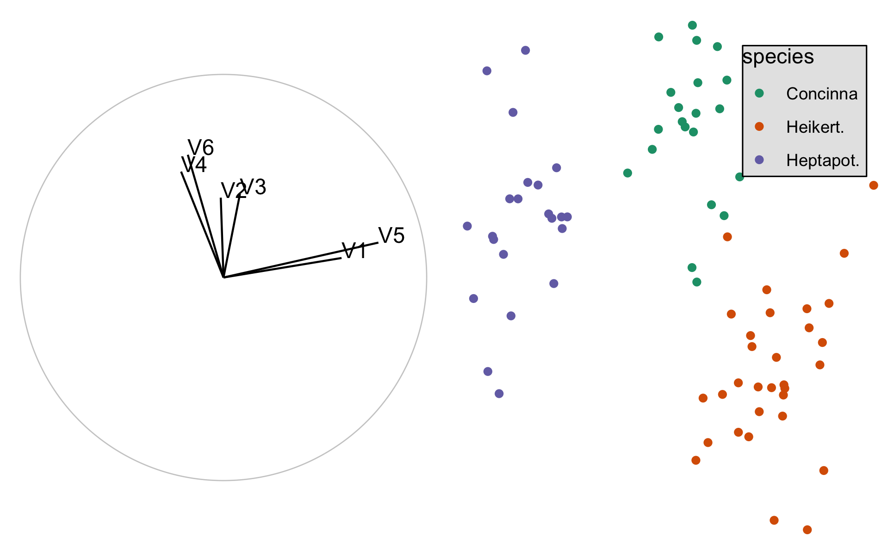
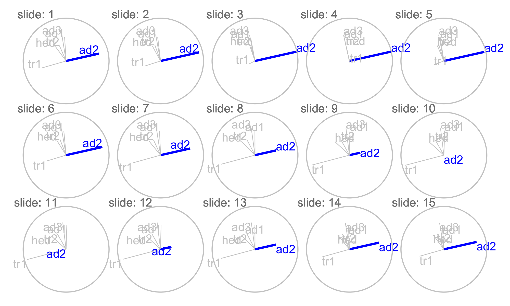

```{r setup_03, include=FALSE}
knitr::opts_chunk$set(
  echo = TRUE, 
  fig.width = 6, 
  fig.asp = 1/1.61, 
  fig.align = "center",
  message = FALSE,
  warning = FALSE,
  collapse = TRUE,
  comment = "",
  cache = FALSE
)
```

# *spinifex*: An R package that provides manual rotations in high-dimensions {#ch:spinifex}

## Abstract

Touring techniques offer a great opportunity for data-space visualizations of ($\textbf{X} \in \mathbb{R}^p,~p > 3$) multivariate data sets. This paper discusses the *R* package *spinifex*, which adds support for the manual tour, which is particularly usefully for exploring the local structure after identifying a feature of interest, perhaps via guided tour. Additionally, *spinifex* extends graphic outputs to *plotly* and *gganimation*. This work extends the functionality of and is compatible with *tourr*.

Keywords: grand tour, projection pursuit, manual tour, tourr, touring, high dimensional visualization, high dim vis, dimensionality reduction, visualization, statistical graphics, data-space.


## Introduction

<!--
What is a tour?
-->

<!--
Multivariate data analysis, and relationship with tour methods: PCA, LDA (t-SNE, local linear embeddings or MDS)
-->

<!--
What is a manual tour, and what is it useful for - DONE
-->


The manual tour was described in @cook_manual_1997, and allows a user to rotate a variable into and out of a 2D projection of high-dimensional space. The primary purpose is to determine the sensitivity of structure visible in a projection to a variable. Manual touring can also be useful for exploring the local structure once a feature of interest has been identified, for example, by a guided tour [@hurley_analyzing_1990]. In guided tours an index of interest defined on the space of all projections, and the function is optimised. It derives from projection pursuit [@friedman_projection_1974], and the guided tour provides a visual interface to the optimisation. The manual tour can be used to help refine structure in the optimal projection, sharpening it by exploring the contributions of different variables, and simplifying by zeroing the coefficients of variables that don't contribute to the structure. 


## Manual tour algorithm

The algorithm contains several steps:

1. Choose a variable to explore, called the manip variable
2. Create a 3D manipulation space, where the variable to be explored has full contribution.
3. Generate the rotation which zero's the coefficient and also increases it to 1

### Notation

Given:
\begin{description}
  \item[$\textbf{X}_{[n,~p]}$] A data set containing $n$ observations of $p$ numeric variables. 
  \item[$\textbf{B}_{[p,~d]}$] An orthonormal \footnote{Where each variable is both: orthogonal, at right angles (dot product is 0) to the other variables, and unit vectors, a norm = 1} basis describing the current orientation projecting $p$ down to $d$ dimension.
\end{description}

\begin{align*}
  \textbf{X}_{[n,~p]} ~=
  \begin{bmatrix}
    X_{1,~1} & \dots  & X_{1,~p} \\
    X_{2,~1} & \dots  & X_{2,~p} \\
    \vdots   & \ddots & \vdots   \\
    X_{n,~1} & \dots  & X_{n,~p}
  \end{bmatrix}
\end{align*}

\begin{align*}
  \textbf{B}_{[p,~d]} ~=
  \begin{bmatrix}
    B_{1,~1} & \dots  & B_{1,~d} \\
    B_{2,~1} & \dots  & B_{2,~d} \\
    \vdots   & \ddots & \vdots   \\
    B_{p,~1} & \dots  & B_{p,~d}
  \end{bmatrix}
\end{align*}

For ease of computation we will be working mostly with the basis and not the data, once basis manipulation is done post multiply the data by the basis to get back to data-space.

### Flea data set

We'll illustrate with the flea data set from the R package *tourr* [@wickham_tourr_2011], which contains different tours on the same data. The data comes from @lubischew_use_1962. The flea data contains 74 observations across 6 variables, physical measurements of each flea beetle. Each individual belonged to one of three species being observed.

We'll perform a guided tour on the flea data optimizing for the index `holes` [@cook_interactive_2007]. Where the basis is projected and the local area is explored for a projection that move the data further from the center. In figure \@ref(fig:step0), below, the left frame depicted the final basis of the `holes` tour; a unit circle with lines showing the x and y contributions of each variable in the projection space. The right frame projects the data through that basis and corlors the points according to the observed species. 

```{r, eval = T, include = F}
library(spinifex)
library(ggplot2)
library(gridExtra)
set.seed(1) #don't think this matters, but can't hurt.

## FLEA HOLES TOUR
flea_std <- tourr::rescale(tourr::flea[,1:6])
hpath    <- tourr::save_history(flea_std, tourr::guided_tour(tourr::holes))
h_bas    <- matrix(hpath[,,max(dim(hpath)[3])], ncol=2)

#0_left
step0_l <- view_basis(h_bas) # Maybe manual tour on v1?

h_m_sp <- create_manip_space(h_bas, manip_var = 1)
h_dat  <- cbind(data.frame(flea_std %*% h_m_sp[, 1:2]), flea$species)
colnames(h_dat) <- c("x", "y", "species")

#0_right
step0_r <- ggplot() +
    geom_point(h_dat, mapping = aes(x=x, y=y, color=species)) +
    scale_color_brewer(palette = "Dark2") +
    theme_void() +
    theme(legend.position=c(0.8, 0.8)) +
    theme(legend.background = element_rect(colour = 'black', fill = 'grey90', linetype='solid'))


#=== Step 0 out
step0 <- grid.arrange(step0_l, step0_r, ncol=2)
ggsave("./output/step0_basis+proj.png", step0,
       height = 4, width = 4*1.61, units = "in")
```
```{r step0, fig.cap = "basis and projection, holes guided tour of flea data", fig.width=4, out.width='100%'}

```

Call the `view_basis()` function to produce the left frame. In touring typically we want dynamic display that looks through many such views, however, you can project a single basis at any time through the matrix multiplication $\textbf{X}_{[n,~p]} ~*~ \textbf{B}_{[p,~d]} ~=~ \textbf{P}_{d[n,~d]}$ to reproduce the right frame.

``` {r eval = F, echo = T}
view_basis <- function(basis,
                      labels = paste0("V", 1:nrow(basis))
) {
  # Initialize
  p <- nrow(basis)
  if (!is.data.frame(basis)) basis <- as.data.frame(basis)
  ## circle
  angle <- seq(0, 2 * pi, length = 360)
  circ  <- data.frame(x = cos(angle), y = sin(angle))
  
  # graphics (reference frame)
  ## circle and set options
  gg1 <- ggplot2::ggplot() + ggplot2::geom_path(
    data = circ, color = "grey80", size = .3, inherit.aes = F,
    mapping = ggplot2::aes(x = circ$x, y = circ$y)
  ) +
    ggplot2::scale_color_brewer(palette = "Dark2") +
    ggplot2::theme_void() +
    ggplot2::theme(legend.position = "none") +
    ggplot2::coord_fixed() # Do not use with plotly!
  ## Axes line segments
  gg2 <- gg1 +
    ggplot2::geom_segment(
      data = basis, 
      mapping = ggplot2::aes(x = basis[,1], y = basis[,2], xend = 0, yend = 0)
    )
  ## Text labels
  gg3 <- gg2 + ggplot2::geom_text(
    data = basis, size = 4, hjust = 0, vjust = 0, colour = "black",
    mapping = ggplot2::aes(x = basis[, 1], y = basis[, 1], label = labels)
  )
  
  gg3
}
```

### Step 1 Choose variable of interest

Select a manipulation variable, $k$. Initialize a zero vector $e$, and set the $k$-th element set to 1.

NOTE: Explanation has math, diagram and code

\begin{align*}
\textbf{e}_{k~[p,~1]} ~=~ 
  \begin{bmatrix}
    0 \\
    0 \\
    \vdots \\
    1 \\
    \vdots \\
    0
  \end{bmatrix}_{[p,~1]}
\end{align*}

In figure \@ref(fig:step0), above, notice the the variables 1 and 5 are almost orthogonal to the other 4 variables and that V5 has a larger contribution than V1. As such, let's select the 5-th variable as our manipulation variable. 

### Step 2 Create the manip space

NOTE: Explanation has math, diagram and code

Use the Gram-Schmidt process to orthonormalize the concatenation of the basis and $e$ yielding the manipulation space.

\begin{align*}
  \textbf{M}_{[p,~d+1]}
  &= Orthonormalize_{GS}( \textbf{B}_{[p,~d]}|\textbf{e}_{k~[p,~1]} ) \\
  &= Orthonormalize_{GS}
  \left(
    \begin{bmatrix}
      B_{1,~1} & \dots  & B_{1,~d} \\
      B_{2,~1} & \dots  & B_{2,~d} \\
      \vdots   & \ddots & \vdots   \\
      B_{k,~1} & \dots  & B_{k,~d} \\
      \vdots   & \ddots & \vdots   \\
      B_{p,~1} & \dots  & B_{p,~d}
    \end{bmatrix}
  ~|~
    \begin{bmatrix}
      0 \\
      0 \\
      \vdots \\
      1 \\
      \vdots \\
      0
    \end{bmatrix}
  \right)
\end{align*}

```{r, eval = T, include = F}
#=== Step 2 out
step2 <- view_manip_sp(h_bas, 5)
ggsave("./output/step2_manip_sp.png", step2,
       units = "in", width = 4, height = 4)
```
```{r step2, fig.cap = "manipulation space, holes guided tour of flea data", out.width='5%'}
knitr::include_graphics("./output/step2_manip_sp.png", dpi=70)
```


```{r, eval = F, echo = T}
view_manip_sp <- function(basis,
                         manip_var,
                         manip_col = "blue",
                         theta = pi * 5/12,
                         z_col = "red",
                         labels = paste0("V", 1:nrow(basis)) 
) {
  # Initialize
  if (!is.null(colnames(basis))) labels <- abbreviate(colnames(basis), 3)
  xyz <- function(df) {colnames(df) <- c("x", "y", "z"); df}
  ## manip space
  m_sp <- xyz(data.frame(create_manip_space(basis, manip_var)))
  p <- nrow(m_sp)
  ## manip var asethetics
  col_v            <- rep("grey80", p)
  col_v[manip_var] <- manip_col
  siz_v            <- rep(0.3, p)
  siz_v[manip_var] <- 1
  ## circle
  angle <- seq(0, 2 * pi, length = 360)
  circ  <- data.frame(x = cos(angle), y = sin(angle), z = 0)
  ## basis rotation
  rot   <- matrix(c(1,0,1, 0,cos(theta),sinpi(theta)), # ,0,0,sin(theta))
                  ncol = 3, byrow = T)
  ## rotation spaces
  circ_r <- xyz(data.frame(as.matrix(circ[, c(1, 2)]) %*% rot))
  m_sp_r <- xyz(data.frame(as.matrix(m_sp[, c(1, 2)]) %*% rot))
  circ_z <- data.frame(x = circ$x, y = circ$y * sin(theta))
  m_sp_z <- data.frame(x = m_sp[manip_var, "x"],
                       y = m_sp[manip_var, "z"] * sin(theta))
  
  # Graphics (reference frame)
  ## xy circle and options
  gg1 <- ggplot2::ggplot() + ggplot2::geom_path(
    data = circ_r, color = manip_col, size = .3, inherit.aes = F,
    mapping = ggplot2::aes(x = x, y = y)
  ) +
    ggplot2::scale_color_brewer(palette = "Dark2") +
    ggplot2::theme_void() +
    ggplot2::theme(legend.position = "none") +
    ggplot2::coord_fixed() # Do not use with plotly!
  ## Axes line segments
  gg2 <- gg1 +
    ggplot2::geom_segment(
      data = m_sp_r, size = siz_v, colour = col_v,
      mapping = ggplot2::aes(x = x, y = y, xend = 0, yend = 0)
    )
  ## Text labels
  gg3 <- gg2 + ggplot2::geom_text(
    data = m_sp_r, size = 4, colour = col_v,
    vjust = "outward", hjust = "outward",
    mapping = ggplot2::aes(x = x, y = y, label = labels)
  )
  ## zx circle
  gg4 <- gg3 + ggplot2::geom_path(
    data = circ_z, color = z_col, size = .3, inherit.aes = F,
    mapping = ggplot2::aes(x = x, y = y)
  )
  ## z manip sp segments, projection line, label
  gg5 <- gg4 + ggplot2::geom_segment(
    data = m_sp_z, size = 1, colour = z_col,
    mapping = ggplot2::aes(x = x, y = y, xend = 0, yend = 0)
  ) + ggplot2::geom_segment(
    data = m_sp_z, size = 1, colour = "grey80", linetype = 2,
    mapping = ggplot2::aes(x = x, y = y, xend = x, yend = m_sp_r[manip_var, "y"] )
  ) + ggplot2::geom_text(
    data = m_sp_z, size = 4, colour = z_col,
    vjust = "outward", hjust = "outward",
    mapping = ggplot2::aes(x = x, y = y, label = labels[manip_var])
  )
  
  gg5
}
```


### Step 3 Generate rotation

NOTE: Explanation has math, diagram and code

Select a vector $\phi_i$, the angle of out-of plane rotation, orthogonal to the projection plane (relative to $\phi_1$, the transformation $\phi_i$ - $\phi_1$ proved to be helpful to discuss $\phi$ relative to the Z axis). 

**For ** $i$ **in 1 to n_slides:**
<!-- Stop trying fix the above, it's not going to happen... -->

For each $\phi_i$, post multiply the manipulation space by a rotation matrix,  producing as many basis-projections.

\begin{align*}
  \textbf{P}_{b[p,~d+1,~i]}
  &= \textbf{M}_{[p,~d+1]} ~*~ \textbf{R}_{[d+1,~d+1]} 
    ~~~~~~~~~~~~~~~~~~~\text{For the $d=2$ case:} \\
  &= \begin{bmatrix}
    M_{1,~1} & M_{1,~2} & M_{1,~3} \\
    M_{2,~1} & M_{2,~2} & M_{2,~3} \\
    \vdots   & \vdots   & \vdots   \\
    M_{p,~1} & M_{p,~2} & M_{p,~3}
  \end{bmatrix}_{[p,~d+1]}
    ~*~
  \begin{bmatrix}
    c_\theta^2 c_\phi s_\theta^2 &
    -c_\theta s_\theta (1 - c_\phi) &
    -c_\theta s_\phi \\
    -c_\theta s_\theta (1 - c_\phi) &
    s_\theta^2 c_\phi + c_\theta^2 &
    -s_\theta s_\phi \\
    c_\theta s_\phi &
    s_\theta s_\phi &
    c_\phi
  \end{bmatrix}_{[3,~3]}
\end{align*}


Where:
\begin{description}
  \item[$\theta$] is the angle that lies on the projection plane ($ie.$ on the XY plane)
  \item[$\phi$] is the angle orthogonal to the projection plane ($ie.$ in the Z direction)
  \item[$c_\theta$] is the cosine of $\theta$
  \item[$c_\phi$]   is the cosine of $\phi$
  \item[$s_\theta$] is the sine of   $\theta$
  \item[$s_\phi$]   is the sine of   $\phi$
\end{description}

To get back to data-space post multiply each projection basis by the data, for  the data projection.

\begin{align}
  \textbf{P}_{d[n,~d+1]}
    &= \textbf{X}_{[n,~p]} ~*~ \textbf{P}_{b[p,~d+1]} \\
    &= \begin{bmatrix}
      X_{1,~1} & \dots & X_{1,~p} \\
      X_{2,~1} & \dots & X_{2,~p} \\
      \vdots   & \vdots & \vdots  \\
      X_{n,~1} & \dots & X_{n,~p}
    \end{bmatrix}_{[n,~p]}
      ~*~
    \begin{bmatrix}
      P_{b:1,~1} & P_{b:1,~2} & P_{b:1,~3} \\
      P_{b:2,~1} & P_{b:2,~2} & P_{b:2,~3} \\
      \vdots     & \vdots     & \vdots     \\
      P_{b:p,~1} & P_{b:p,~2} & P_{b:p,~3}
    \end{bmatrix}_{b[p,~d+1]}
\end{align}


```{r, eval = T, include = F}
mtour <- manual_tour(h_bas, manip_var = 5, n_slides = 15)
bases <- create_slides(tour = mtour, data = flea_std)
bases <- bases$basis_slides

mag <- 2.2
grid  <- data.frame(slide = 1:15, x = mag*rep(1:5, 3), y = mag*rep(3:1, each = 5))

# Initialize
## manip var asethetics
n_slides         <- max(bases$slide)
p                <- nrow(bases) / n_slides
manip_var        <- 5
col_v            <- rep("grey80", p)
col_v[manip_var] <- "blue"
col_v            <- rep(col_v, n_slides)
siz_v            <- rep(0.3, p)
siz_v[manip_var] <- 1
siz_v            <- rep(siz_v, n_slides)
## circle
angle <- seq(0, 2 * pi, length = 180)
circ  <- data.frame(c_x = cos(angle), c_y = sin(angle))
circ[nrow(circ)+1, ] <- NA

bases_grid <- merge(x = bases, y = grid, by = "slide", all = TRUE) # OUTER JOIN
circ_grid <- merge(x = circ, y = grid, by = NULL) # CROSS JOIN,

#=== Step 3 out
(step3 <- ggplot(data = bases_grid) +
  geom_segment(aes(x = V1+x, y = V2+y, xend = x, yend = y),
               color = col_v, size = siz_v) +
  geom_text(aes(x = V1+x, y = V2+y, label = lab_abbr),
            color = col_v, vjust = "outward", hjust = "outward") +
  geom_text(aes(x = x-.7, y = y+1.1, label = paste0("slide: ",slide)), 
            color = "grey50") +
  geom_path(data = circ_grid, mapping = aes(x = x+c_x, y = y+c_y), color = "grey80") +
  theme_void())
ggsave("./output/step3_manual_tour.png", step3, 
       width = 4*(5/3), height = 4, units = "in")
```
```{r step3, fig.cap = "manual tour, holes guided tour of flea data"}

```


```{r, eval = F, echo = T}
manual_tour <- function(basis = NULL,
                        manip_var,  # column number
                        theta = NULL,      # (radians)
                        phi_min = 0,       # (radians)
                        phi_max = .5 * pi, # (radians)
                        n_slides = 20
) {
  # Initalize
  if (!is.matrix(basis)) basis <- as.matrix(basis)
  if (is.null(theta)) theta <- atan(basis[manip_var, 2] / basis[manip_var, 1])
  manip_space    <- create_manip_space(basis = basis, manip_var = manip_var)
  p              <- nrow(basis)
  d              <- ncol(basis)
  phi_start      <- acos(sqrt(basis[manip_var, 1]^2 + basis[manip_var, 2]^2))
  phi_start_sign <- phi_start * sign(manip_space[manip_var, 1])
  phi_inc        <- 2 * abs(phi_max - phi_min) / (n_slides - 3)
  stopifnot(phi_min <= phi_start & phi_max >= phi_start)
  
  interpolate_walk <- function(seq_start, seq_end){
    # Initialize for interpolate_slides()
    slide        <- 0
    new_slide    <- NULL
    seq_start    <- seq_start + phi_start_sign # Transform such that phi is relative to Z=0, rather than phi_start
    seq_end      <- seq_end   + phi_start_sign
    phi_inc_sign <- phi_inc * ifelse(seq_end > seq_start, 1, -1) 
    phi_len      <- length(seq(seq_start, seq_end, phi_inc_sign))
    interp       <- array(dim = c(p, d, phi_len))
    
    # Create slide, store in interpolation
    for (phi in seq(seq_start, seq_end, phi_inc_sign)) {
      slide <- slide + 1
      interp[,, slide] <- rotate_manip_space(manip_space, theta, phi)[, 1:2]
    }
    return(interp)
  }
  
  walk1 <- interpolate_walk(phi_start, phi_min)
  walk2 <- interpolate_walk(phi_min, phi_max)
  walk3 <- interpolate_walk(phi_max, phi_start)
  walk4 <- interpolate_walk(phi_start, phi_start)
  
  m_tour <- array(c(walk1, walk2, walk3, walk4), dim = c(p, d, n_slides))
  attr(m_tour, "manip_var") <- manip_var
  
  return(m_tour)
}
```

## Display projection sequence

<!--
- Lack of full interaction in R
- Animation packages
- Saving a sequence of projections, tourr, save_history
- Generating manual sequence off-line, replaying with animation package
-->

Plot the first 2 variables from each projection in sequence for an XY scatterplot. The remaining variable is sometimes linked to a data point aesthetic to produce depth cues used in conjunction with the XY scatterplot.


## Installation

spinifex is open source and hosted on [GitHub](https://github.com/nspyrison/spinifex). The development version is available for download by running `devtools::install_github("nspyrison/spinifex")`
on your R console.


## Application
```{r, eval=F,include=F}
# for reproducing PDF Sense paper figure 8, open the follow in it's own project.
if (F) file.edit('../PDFSense_tour/__fig8_repex.r')

load("./data/grDIScenter.rda")
load("./data/fGT_6d.rda")

animate(select(grDIScenter,-type, -disID),
        planned_tour(fGT_6d),
        aps = 4,
        display_groupxy(col = grDIScenter$disID, group_by=grDIScenter$disID, gp_legend = FALSE))

```

apply manual tours to Ursula fig 1 here:
NOTE: Examples from https://arxiv.org/abs/1806.09742

First stab at reproducing Fig8 from the PDFSense paper, is hosted here:
[nspyrison.netlify.com](https://nspyrison.netlify.com/else/pdfsense_fig8repex/)

## Source

The code used to generate this chapter can be found at this [GitHub page](https://github.com/nspyrison/Confirmation/blob/master/03-spinifex.Rmd).


## Discussion

Future work:

- other rotation mechanisms like Givens and Householder
- oblique should be defined.
- other display types, would work for 1D displays, but others would need redefinition difference dimensions
- shiny app, for choosing manip variable, providing different starting projections
