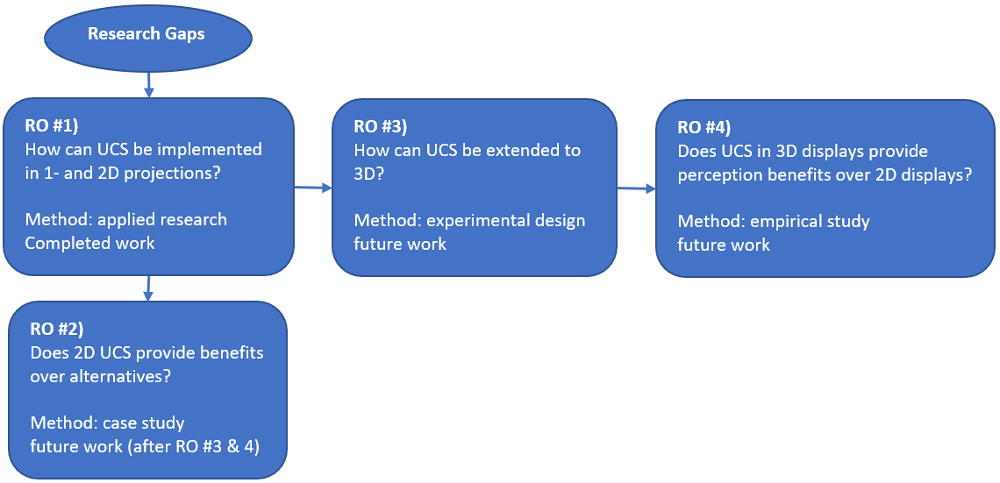

# Project overview {#ch:projectoverview}

The research gaps in the literature review leave room for the research objectives outlined in the introduction. Figure \@ref(fig:ProjectOverview) depicts a schematic flow chart that the research objectives will be executed in. RO #1, application of 2D user-controlled steering (UCS), sets the foundation for which the other objectives can be researched. RO #3, the application of 3D UCS, must precede RO #4, exploring the efficacy of 3D UCS across display devices. RO #2, the comparison of 2D UCS vs alternatives, must come after RO #1, but is of lower priority to RO #3 & 4, and so will be conducted last, in the event of a time crunch.

(ref:ProjectOverview-cap) Flow chart of research objective (RO) dependencies, work order, and methodology.

```{r ProjectOverview, echo=F, out.width='100%', fig.cap = "(ref:ProjectOverview-cap)"}

```
