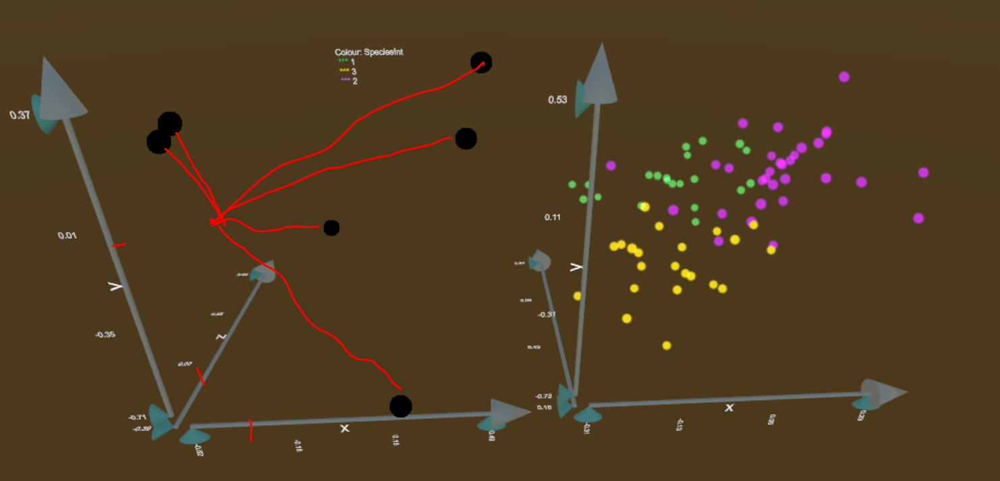

# Future work {#ch:future_work}

## RO #2) Does 2D UCS provide benefits over alternatives?

Dimensionality reduction is important to viewing high dimensional data spaces. There are various techniques have been developed to view projections of data. The research answering this question would quantify the potential benefits of dynamic 2D UCS over commonly used alternatives. All comparison groups would be unsupervised (agnostic of clustering), static, single embeddings in a lower dimension, and would include:

- **Principal Component Analysis (PCA)** [@pearson_liii._1901], a linear transformation that forms orthogonal linear combinations of the variables by maximizing the amount of variation that is independent of all preceding components. That is, the first principal component is the linear combination that explains the most variation in one direction, the second component explaining the most of the remaining variation and is orthogonal to the first, and so on. 
- **Multi-Dimensional Scaling (MDS)**, non-linear dimension reduction that compares pairwise distances between observations.
- **t-distributed neighbor embeddings (tSNE)** [@maaten_visualizing_2008], a nonlinear technique that iterates epochs of 1) constructing a probability distribution for selecting neighboring data and 2), minimizing Kullback-Leibler divergence (a measure of relative entropy).

Unfortunately, static linear projections necessarily lose the variation of the components not displayed, while non-linear techniques lose transparency back to the original variable space. On the other hand, dynamic linear projections keep variation in tack (at the expense of viewing over time) and preserve transparency to variable-space. User-controlled steering of tours allows for finer exploration local exploration, which should be reflected in the benefits over alternative options.

The methodology for this future work is a **performace comparison** across technique, as assessed across contemporary benchmark datasets. Differences in the techniques make for an uneven comparison, but measurements will be made where applicable comparing at least variation, clustering, and structure. The design space includes data sets, techniques, and measures of comparison.

## RO #3) How can UCS be extended to 3D?

The literature has shown positive results for improved perception of 3D graphics over 2D. The additional dimension theoretically allows for the improved structural perception in 3D scatterplots and would allow for the novel application of the dynamic projection of multidimensional function spaces. The research answering RO #1 will be extended for these uses.

The work presented in @cordeil_imaxes:_2017 creates immersive space for users to explore data in a virtual environment. Users can actively create different visualization by spatial manipulation of virtual variable-axes. Bringing dynamic projection into an environment that offers immersive interaction could be a boon to interfacing with something so dynamic in nature. The ability to render in 3D could also act as a common interface that can be used across various display devices in RO #4.

The research addressing this objective applies **algorithm design**, first, the *R* package spinifex will be extended to 3D and function/surface projections will be developed. After the projections are computed, *Unity* will be used to render the embeddings in 3D VR and act as a compatible front end to be used across display devices. 

Manipulating 3D spaces may not be straight forward. In section {sec:algorithm} the manipulation space was in 3D, where 2 angles defined a point that was projected back to the 2D reference frame. The now 4D manipulation space should only be necessary for internal mathematics, where the 3 angles spanning it, could be controlled through manipulation of a selected variable on the now 3D reference volume. Navigating 3D space may be very intuitive or may require a slide ruler for each axis may offer more control. An additional concern of user interaction is the potential for objects in peripheral vision to cause discomfort. The angular speed of the projections should be regulated for continuity of observation and to mitigate potentially nauseating movement. 

(ref:RO3MockUp-cap) A mockup of a 3D basis reference space (left) and scatterplot projection (right). Basis axes should extend from the origin to allow a better perception of magnitude and direction each variable contributes to the projection.

```{r RO3MockUp, echo=F, out.width='70%', fig.cap = "(ref:RO3MockUp-cap)"}

```

In a function projection, a multi-parameter function surface would be projected rather than individual data points. Imagining the projection of a unit grid is a useful middle ground. Viewing projected functions may have several difficulties in 3D. The first is occulation, the surfaces in the foreground blocks the view behind it. Opacity, wire mesh, and projection sectioning [@furnas_prosection_1994] are potential ways to address this issue. A second issue is that it may be disorienting or nauseating to watch surfaces folding into each other in seemingly non-euclidean movements. Changing opacity or focus in the vicinity of these areas may mitigate the potential concern.

The design space for this research includes the path generators (outlined in section \ref{sec:path_generation}), geometric display (section \ref{sec:geom_display}), layout in virtual space, dynamic interactions. Tour paths are conceptually straight-forward mapping between values and 3D rendering. Each geometric display will need unique recreation, though 3D scatterplot, parallel coordinate plots, and scatterplot matrices (SPLOMs) are currently supported in the respective packages.

## RO #4) Does UCS in 3D displays provide perception benefits over 2D displays? {#UCS_3dvs2d}

The bulk of previous tours were performed in 2D, with the exceptions of @nelson_xgobi_1998 and @arms_benefits_1999 who conducted an $n=15$ experimental study comparing tasks performed across 2D and 3D tour displays. The XGobi interface was used on a standard 2D monitor while VRGobi (on the C2 setup) was used with head-tracked, binocular VR. The three accuracy tasks: clustering, intrinsic data dimensionality, and radial sparseness were recorded along with the speed of brushing data. Accuracy was the same for the dimensionality task, while 3D display outperformed 2D on clustering, and even more so on the radial sparsity task. However, the time taken to brush a cluster was less than half the time in 2D displays as compared with 3D. 

@wagner_filho_immersive_2018 performed a user study on the perception of linear projections between 2D, 3D, and immersive 3D. The $n=30$ user study created 3D embeddings of multidimensional data via principal component analysis (PCA, described in RO #2, above). Users performed three tasks across two data sets and three displays; 2D, 3D, and immersive 3D. Data sets were chosen to have vastly different amounts of information contained in the 3rd principal component. They find that the introduction of a 3rd dimension in visualization improves task performance (perception error, task error, and completion time) regardless of immersion for only the dataset containing large amounts of variation in the 3rd principal component. Independent of the dataset, immersive 3D display led to a larger subjective perception of accuracy and engagement.

The results of @wagner_filho_immersive_2018, @nelson_xgobi_1998 and, @arms_benefits_1999 cast positive light on 3D spaces improving the perception of embeddings of high-dimensional data. Others have found the same for tri-variate data. After tours have been extended in 3D spaces (RO #3), the effects of viewing dynamic projections should be quantified across the display type.

A controlled **usability study** will be performed to measure the benefits of 3D over 2D display devices. Every participant will complete every task on every display device. Task order and display device will be randomly assigned to minimize learning bias. Correctness and speed of tasks will be recorded alongside demographic data and subjective 5-point Likert scale survey. A lineup model as outlined in @hofmann_graphical_2012 may be employed to quantify the "best" display device. This lineup model is a visual variant of statistical p-test where participants are asked to pick the real data set as pitted against data generated from the null hypothesis. Running such a lineup within all display devices and comparing accuracy may rank the quality of the display device.  

The factors of the study are user tasks: the perception of cluster structure, surface structure, and ranking of manipulation variables. All factors will be tested across the treatment of at least three display devices: standard 2D monitor, stereoscopic 3D monitor (on a zSpace 200), and head-mounted VR goggles (HTC VIVE). The user interface will be standardized across display devices. The data explored will be of high energy physics experiments already being discussed in publication [@wang_visualizing_2018; @cook_dynamical_2018] and looked at in 2D UCS in appendix \ref{ch:spinifex_paper}.

