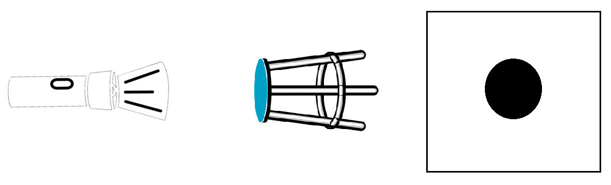
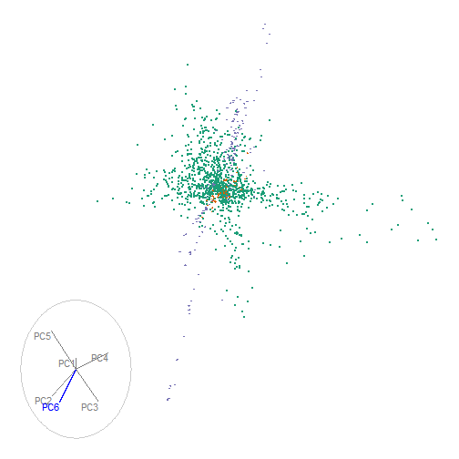

```{r setup, include=FALSE,}
knitr::opts_chunk$set(
  eval      = TRUE,  # R code 
  echo      = FALSE, # code
  include   = TRUE,  # plots
  results   = 'markup', # text 'markup' 'asis' 'hold' 'hide'
  message   = F, warning = F, error = F, cache = F, cache.lazy = F,
  collapse  = TRUE,
  comment   = "",
  fig.align = "center"
  #fig.show = "hold",
  #strip.white = TRUE,
)
htmlwidgets::sizingPolicy(padding = 0, browser.fill = TRUE)
```

# Contents

- Research question
- 2D Dynamic low-dimensional embeddings
- RO #A) Can user controlled steering (UCS) be utilized in an environment providing non-dynamic animation?
- RO #B) What benefits does UCS provide over popular alternatives?
- 2D vs 3D low-dimensional embeddings
- RO #C) How do we extend UCS to 3D?
- RO #D) Does UCS with 3D displays provide perception benefits over 2D displays?
- Research timeline

---

# Research question

** Does allowing the user to steer the tour, facilitate the exploration and understanding
of the sensitivity of structure to the original variables or parameters? **

- A) Can user controlled steering (UCS) be utilized in an environment providing non-dynamic animation?
- B) What benefits does UCS provide over popular alternatives?
- C) How do we extend UCS to 3D?
- D) Does UCS with 3D displays provide perception benefits over 2D displays?

---

# Dynamic low-dimensional embeddings

Linear projection of multivariate numeric data from $p$ to $d$ dimension as $p-$space is rotated. Collectively known at **tours**.

Useful for indentifying clusters, outliers, and structure

Shadow puppet analogy:



---

# guided tour, flea example

.pull-left[
<br>
- Linear combination of the variables displayed on a unit circle, a *reference frame*. <br><br>
- This is a *guided tour*, uses projection pursuit to optimising more white space in the middle of a projection
]

.pull-right[
```{r, echo=F, out.width='90%'}
knitr::include_graphics("./images/FleaHolesTour.gif")
```
]

<br>

created with R package `tourr` *(Wickham et al. 2011)*

---

# RO #A) 2D user controlled steering (UCS)

Yes: *manual tour* applying *Cook & Buja 1997*. `spinifex` R package, [github.com/nspyrison/spinifex](https://github.com/nspyrison/spinifex). 

Continueing from the last projection of our guided tour:

.pull-left[
```{r, results='hide', out.height='80%', out.width='80%'}
library(spinifex)
f_dat  <- tourr::rescale(flea[,1:6])
f_cat  <- factor(flea$species)
f_path <- save_history(f_dat, guided_tour(holes()))
f_bas  <- matrix(f_path[,, max(dim(f_path)[3])], ncol=2)
f_mvar <- 5
# f_msp  <- create_manip_space(basis = f_bas, manip_var = f_mvar)
# f_proj <- data.frame(tourr::rescale(f_dat %*% f_msp[, 1:2]))

view_basis(f_bas, labels = colnames(f_dat))
```
]

.pull-right[
```{r, out.height='80%', out.width='80%'}
view_manip_space(basis = f_bas, manip_var = f_mvar, labels = colnames(f_dat))
```
]

---

# 2D UCS -- Application  


Particle physics data, $\textbf{X} \in \mathbb{R}^{56}$, *Wang, et. al. 2018*


.pull-left[
```{r, results='hide', fig.height=2, fig.width=2}
##DIS cluster, fig 8 of cook_dynamical_2018
load("../data/grDIScenter.rda")
load("../data/DIScluster_centered_basis.rda")
DIS_bas   <- DIScluster_centered_basis
DIS_dat   <- tourr::rescale(grDIScenter[, 1:6])
DIS_cat   <- factor(grDIScenter$disID)
DIS_mvar  <- 6
DIS_ang   <- .15
DIS_mtour <- manual_tour(basis = DIS_bas, manip_var = DIS_mvar, angle = DIS_ang)

### GGANIMATE
DIS_mt <- play_manual_tour(data = DIS_dat, basis = DIS_bas, manip_var = DIS_mvar,
                           angle = DIS_ang, axes="bottomleft", cat_var = DIS_cat, 
                           render_type = render_gganimate)

gganimate::anim_save(filename = "./images/DIS_mt.gif", animation = DIS_mt, end_pause= 5)
```
```{r, out.width='100%', out.height='100%'}

```
]
.pull-right[
<br>
- Summarize the $p=56$ in 6 principal components, ~48% of the variation in the data.
- Find the starting basis, previously publshed figures. 
]

As an [html widget](https://nspyrison.netlify.com/thesis/discluster_manualtour_pc6/)


---

# RO #B) UCS provide over alternatives?

**Future case study**

.pull-right[]


---

# 2D vs 3D low-dimensional embeddings

- 

---

# How do we extend UCS to 3D? (RO #C)

---

# Does UCS with 3D displays provide perception benefits over 2D displays? (RO #D)

---

# Research timeline

```{r timeline, echo=F,}
#out.extra='angle=90
## working from: https://stats.andrewheiss.com/misc/gantt.html
library(tidyverse)
library(lubridate)
library(scales)

tasks <- tribble(
  ~Start,       ~End,         ~Project,     ~Task,
  "2018-04-01", "2019-06-01", "UCS in 2D",  "RO: A) spinifex package, 2D UCS",
  "2018-04-01", "2019-02-01", "UCS in 2D",  "spinifex code",
  "2018-12-01", "2019-03-01", "UCS in 2D",  "spinifex paper",
  "2019-03-01", "2019-06-01", "UCS in 2D",  "spinifex Submission (R Journal)",
  "2019-01-01", "2019-03-01", "Milestones", "Candidature confirmation",
  
  "2019-03-01", "2019-12-01", "UCS in 3D",  "RO: C) Tours, UCS in 3D",
  "2019-03-01", "2019-08-01", "UCS in 3D",  "UCS to IATK, C# code",
  "2019-06-01", "2019-09-01", "UCS in 3D",  "UCS in 3D paper",
  "2019-09-01", "2019-12-01", "UCS in 3D",  "UCS in 3D Submission (VAST)",
  "2020-01-01", "2020-03-01", "Milestones", "Mid candidature review",
  
  "2019-10-01", "2020-09-01", "UCS, 2D vs 3D", "RO: D) UCS across disp type, 2D vs 3D",
  "2019-10-01", "2020-02-01", "UCS, 2D vs 3D", "2D vs 3D C# code",
  "2020-01-01", "2020-04-01", "UCS, 2D vs 3D", "2D vs 3D Experimental survey",
  "2020-03-01", "2020-06-01", "UCS, 2D vs 3D", "2D vs 3D paper",
  "2020-06-01", "2020-09-01", "UCS, 2D vs 3D", "2D vs 3D Submission (CHI)",
  
  "2020-04-01", "2020-12-01", "UCS Benefits", "RO: B) UCS Benefits over alternatives",
  "2020-04-01", "2020-08-01", "UCS Benefits", "UCS Benefits C# code and comparison",
  "2020-06-01", "2020-09-01", "UCS Benefits", "UCS Benefits paper",
  "2020-09-01", "2020-12-01", "UCS Benefits", "UCS Benefits Submission (VAST)",
  
  "2020-11-01", "2021-03-01", "Milestones", "pre-submission presentation",
  "2021-01-01", "2021-04-01", "Milestones", "thesis completion and submission"
)

# Convert data to long for ggplot
tasks.long <- tasks %>%
  mutate(Start = ymd(Start),
         End = ymd(End)) %>%
  gather(date.type, task.date, -c(Project, Task)) %>%
  #arrange(date.type, task.date) %>%
  mutate(Task = factor(Task, levels=rev(unique(Task)), ordered=T))
# Custom theme for making a clean Gantt chart
theme_gantt <- function(base_size=11) {
  ret <- theme_bw(base_size) %+replace%
    theme(panel.background = element_rect(fill="#ffffff", colour=NA),
          axis.title.x=element_text(vjust=-0.2), axis.title.y=element_text(vjust=1.5),
          title=element_text(vjust=1.2),
          panel.border = element_blank(), axis.line=element_blank(),
          panel.grid.minor=element_blank(),
          panel.grid.major.y = element_blank(),
          panel.grid.major.x = element_line(size=0.5, colour="grey80"),
          axis.ticks=element_blank(),
          legend.position="bottom", 
          axis.title=element_text(size=rel(0.8)),
          strip.text=element_text(size=rel(1)),
          strip.background=element_rect(fill="#ffffff", colour=NA),
          panel.spacing.y=unit(1.5, "lines"),
          legend.key = element_blank())
  
  ret
}

# Calculate where to put the dotted lines that show up every three entries
x.breaks <- seq(length(tasks$Task) + 0.5 - 3, 0, by=-3)

# Build plot
timeline <- ggplot(tasks.long, aes(x=Task, y=task.date, colour=Project)) + 
  geom_line(size=6) + 
  geom_vline(xintercept=x.breaks, colour="grey80", linetype="dotted") + 
  guides(colour=guide_legend(title=NULL)) +
  labs(x=NULL, y=NULL) + coord_flip() +
  scale_y_date(date_breaks="2 months", labels=date_format("%b ‘%y")) +
  theme_gantt() + theme(axis.text.x=element_text(angle=45, hjust=1)) +
  scale_color_brewer(palette = "Dark2")

timeline
```

---

# Milestone documents

- FIT 5144 hours
    - \>120 hours **Tracked, evidence needs cleanup**, due at mid-candidature review.
- WES Academic record
    - FIT6021: 2018 S2, **Completed** with Distinction
    - FIT5144: 2019 S1+2, **Upcoming**, due at mid-candidature review
    - FIT5113: 2018 S2, **Exemption submitted**
- myDevelopment - IT: Monash Doctoral Program - Compulsory Module
    - Monash Graduate Research Student Induction: **Completed** 
    - Research Integrity - Choose the Option most relevant: **Completed** (2 required of 4)
    - Faculty Induction: **Content unavailable** (9/02/2019: "Currently being updated and will be visible in this section soon".)


<!-- --- -->

<!-- # Touring typology -->

<!-- - Manual choice - **"manual tour"** selecting a variable and manipulation *(Cook & Buja 1997)* -->
<!--     - R implementation via the package `spinifex`, available on [github](https://github.com/nspyrison/spinifex) -->
<!--     `devtools::install_github("nspyrison/spinifex")` -->

<!-- <br> -->
<!-- Already implemented in R package `tourr`*(Wickham et al. 2011)*, available on CRAN:  -->

<!-- - Random choice - "grand tour" random forest walk in $p$-space *(Asimov 1985)* -->
<!-- - Precomputed choice - *eg.* "little tour" step through increments of all variables in order *(McDonald 1982)* -->
<!-- - Data driven - "guided tour" stochastic gradient descent on objective function *(Hurley & Buja 1990)* -->

<!-- <br> -->
<!-- For more detail see *Buja et al. 2005* -->

<!-- --- -->

<!-- # Manual tours (1/3) -->

<!-- As described in *Cook & Buja 1997*: -->

<!-- - Data, $x_{[n,~p]}$ -->
<!--     - $n$ is observations -->
<!--     - $p$ is numeric variables (dimensions) -->
<!--     - For ease of computation, we'll set this aside -->
<!-- - Basis, $b_{[p,~d]}$, an orthonormal matrix, the linear combinations of $p$ dimensions down to $d$-dimensional space. Essentially the orientation of the data and how it maps to $d$ dimensions -->
<!-- - We need to add a dimension in order to rotate the basis outside of the $d$-plane -->
<!--     - Choose a manipulation variable, $k$ -->
<!--     - $e_{[p,~1]}$, be a zero column vector with the $k$-th element set to 1 -->
<!--     - manipulation space, $m_{[p,~d+1]} = orthonormalize(b||e)$ -->

<!-- --- -->

<!-- # Manual tours (2/3) -->

<!-- - Let rotation matrix, $r_{[d+1,~d+1]}(\theta,~\phi)$, where -->
<!--     - $\theta$ is the angle(s) of rotation within the basis plane -->
<!--     - $\phi$ is the angle of rotation out of the basis plane -->
<!-- - Rotate manipulation space $rm_{[p,~d+1]} = m_{[p,~d+1]} * r_{[d+1,~d+1]}$ be a rotated manipulation space -->
<!--     - The first $d$ dimensions of $rm$ is the map to our lower dimensional embedding (shadow) -->
<!-- - Project our data $p_{[n,~d+1]} = x_{[n,~p]} * rm_{[p,~d+1]}$ -->

<!-- --- -->

<!-- # Manual tours (3/3) -->

<!-- - One frame, projecting $p$-dim data into $d$-space -->
<!-- - Rinse and repeat making small changes to $\phi$, we create an animation as we control the contribution of selected variable -->

<!-- ### Example -- Wine data -->

<!-- 178 observations of 13 numeric variables, and type of grape (3 levels) -->

<!-- ```{r echo=TRUE} -->
<!-- library(spinifex) -->
<!-- data(wine) -->
<!-- wine_std <- tourr::rescale(wine[, -1]) # without type of grape -->
<!-- rb <- basis_random(n = ncol(wine_std)) -->

<!-- mySlideshow <- play_manual_tour(data = wine_std, basis = rb, manip_var = 1,  -->
<!--                                 cat_var = wine$Type, axes = "bottomleft") -->
<!-- ``` -->

<!-- --- -->

<!-- # Manual tour example -->

<!-- ```{r, fig.hight = 5, fig.width = 8, fig.align='center'} -->
<!-- #out.width = "80%", -->
<!-- play_manual_tour(data = wine_std, basis = rb, manip_var = 1,  -->
<!--                                 cat_var = wine$Type, axes = "bottomleft") -->
<!-- ``` -->

<!-- --- -->

<!-- # Going further -->

<!-- - Bring touring to VR -->
<!-- - Experimental study between 2D and 3D displays -->

<!-- ```{r, results="hold", out.width = "80%"} -->
<!-- knitr::include_graphics("./images/tourr2vr.PNG") -->
<!-- ``` -->

<!-- --- -->

<!-- # References (1/2) -->

<!-- In order of appearance: -->

<!-- - Wickham, H., Cook, D., & Hofmann, H. (2015). Visualizing statistical models: Removing the blindfold: Visualizing Statistical Models. Statistical Analysis and Data Mining: The ASA Data Science Journal, 8(4), 203-225. https://doi.org/10.1002/sam.11271 -->
<!-- - Buja, A., Cook, D., Asimov, D., & Hurley, C. (2005). Computational Methods for High-Dimensional Rotations in Data Visualization. In Handbook of Statistics (Vol. 24, pp. 391-413). Elsevier. https://doi.org/10.1016/S0169-7161(04)24014-7 -->
<!-- - Asimov, D. (1985). The grand tour: a tool for viewing multidimensional data. SIAM Journal on Scientific and Statistical Computing, 6(1), 128-143. -->
<!-- - McDonald, J. A. (1982). INTERACTIVE GRAPHICS FOR DATA ANALYSIS. -->

<!-- --- -->

<!-- # References (2/2) -->

<!-- - Hurley, C., & Buja, A. (1990). Analyzing High-Dimensional Data with Motion Graphics. SIAM Journal on Scientific and Statistical Computing, 11(6), 1193-1211. https://doi.org/10.1137/0911068 -->
<!-- - Cook, D., & Buja, A. (1997). Manual Controls for High-Dimensional Data Projections. Journal of Computational and Graphical Statistics, 6(4), 464-480. https://doi.org/10.2307/1390747 -->
<!-- - Wickham, H., Cook, D., Hofmann, H., & Buja, A. (2011). tourr???: An R Package for Exploring Multivariate Data with Projections. Journal of Statistical Software, 40(2). https://doi.org/10.18637/jss.v040.i02 -->
<!-- - R Core Team (2018). R: A language and environment for statistical -->
<!--   computing. R Foundation for Statistical Computing, Vienna, Austria. URL -->
<!--   https://www.R-project.org/. -->

<!-- --- -->

<!-- # Appendix (1/2) -->

<!-- `tourr::animate_groupxy()` -->

<!-- ```{r, results="hold", out.width = "50%"} -->
<!-- knitr::include_graphics("./images/FleaHolesTour_groupxy.gif") -->
<!-- ``` -->

<!-- available on github: `devtools::install_github("nspyrion/tourr")` -->

<!-- --- -->

<!-- # Appendix (2/2) -->

<!-- `tourr::animate_density2d()` -->

<!-- ```{r, results="hold", out.width = "50%"} -->
<!-- knitr::include_graphics("./images/FleaHolesTour_density2d.gif") -->
<!-- ``` -->

<!-- available on github: `devtools::install_github("nspyrion/tourr")` -->
